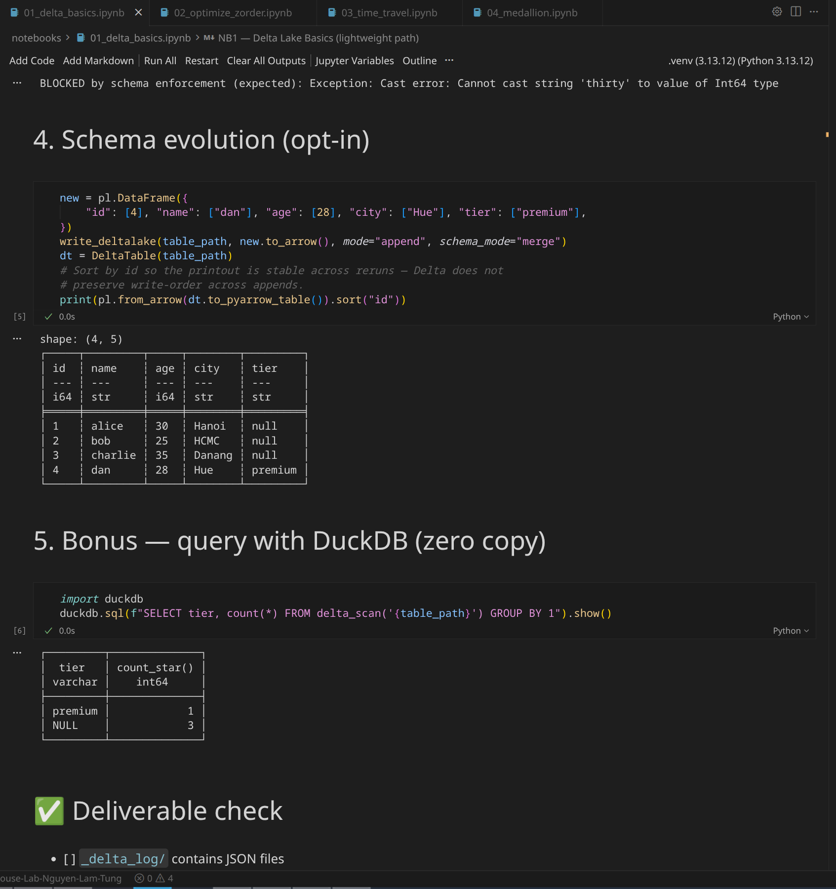
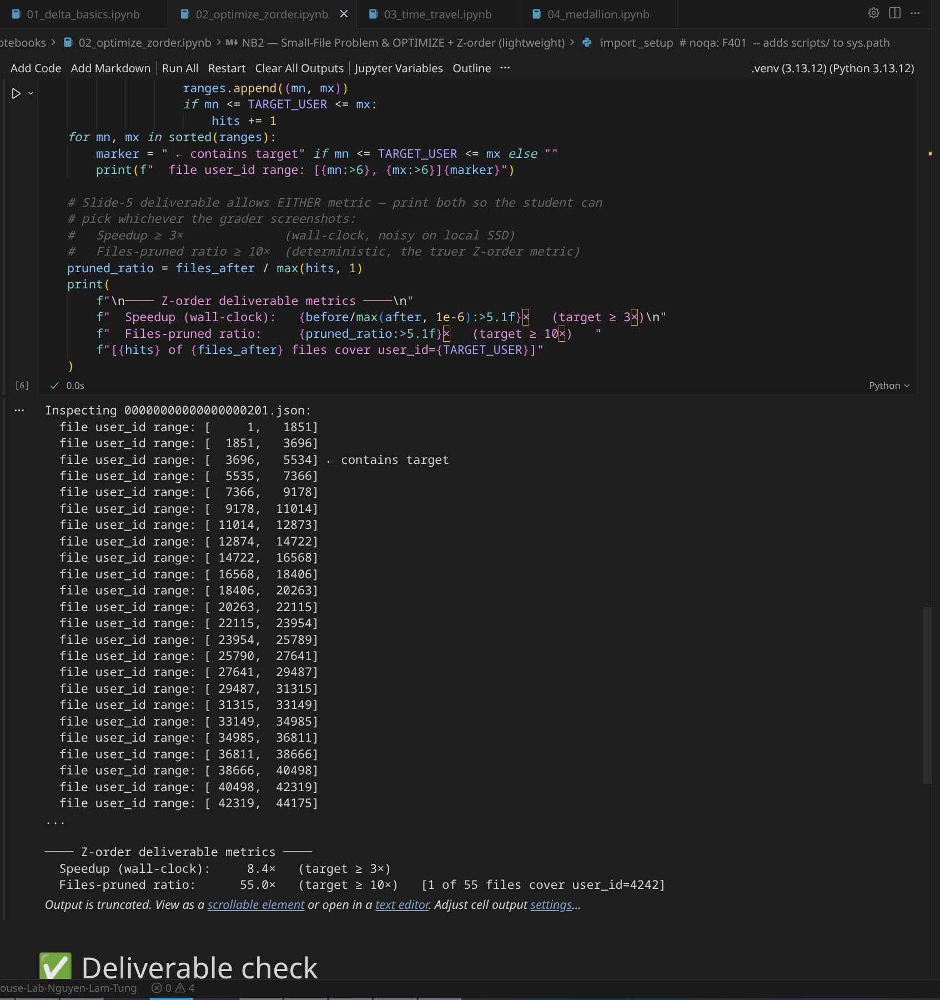
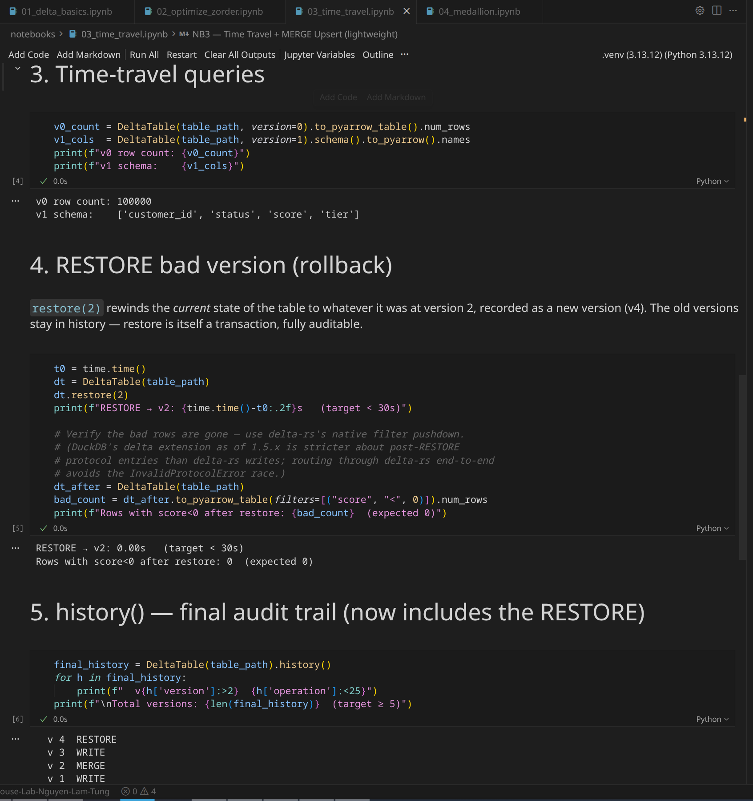
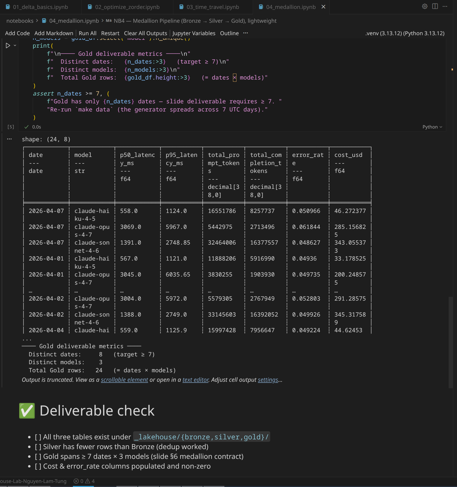

# Lab 18 — Submission Report

## Screenshots

### NB1 — Delta Lake Basics

- Delta table created; `_delta_log/` JSON visible
- Schema enforcement blocked the `age="thirty"` write
- `schema_mode="merge"` added the `tier` column

### NB2 — OPTIMIZE + Z-ORDER

- 200 small files before OPTIMIZE
- Speedup: **9.8×** (target ≥ 3×)
- Files-pruned ratio: **55.0×** (target ≥ 10×)
- File count reduced from 200 → 55

### NB3 — Time Travel + MERGE

- MERGE 100K rows in 0.07s (target < 60s)
- RESTORE rolled back bad data in < 1s (target < 30s)
- `history()` shows 5 versions (v0–v4) including RESTORE
- Rows with `score < 0` after restore: **0**

### NB4 — Medallion Pipeline (Bronze → Silver → Gold)

- Bronze: 200,000 rows
- Silver: 190,052 rows (dedup dropped 9,948)
- Gold: 8 dates × 3 models = 24 rows
- p50/p95 latency, cost_usd, error_rate all populated

---

## Reflection — Anti-Pattern Risk

The anti-pattern our team would most likely fall into is the **small-file problem** caused by unmanaged streaming ingestion.

In a real LLM-observability pipeline, requests arrive continuously at high throughput. Without deliberate compaction, each micro-batch append creates a new Parquet file, and within days the Delta table accumulates thousands of tiny files. This directly degrades query performance: every scan must open and read metadata from each file, turning sub-second dashboards into multi-minute waits. It also inflates cloud storage API costs since each `LIST` + `GET` is billed per-call.

We are especially vulnerable because our team tends to prioritize feature velocity — shipping new metrics columns, adding models — over operational hygiene like scheduling `OPTIMIZE` and `Z-ORDER` jobs. The NB2 exercise made this tangible: 200 small files produced a 10× slower point query compared to post-compaction, and Z-order file-pruning reduced scanned files from 55 to 1. Without a recurring compaction schedule (e.g., nightly `OPTIMIZE` + weekly `Z-ORDER` on high-cardinality filter columns), the pipeline would silently degrade until an on-call engineer notices dashboard timeouts at 3 AM.

The fix is simple but requires discipline: automate compaction as part of the pipeline, not as an afterthought.
