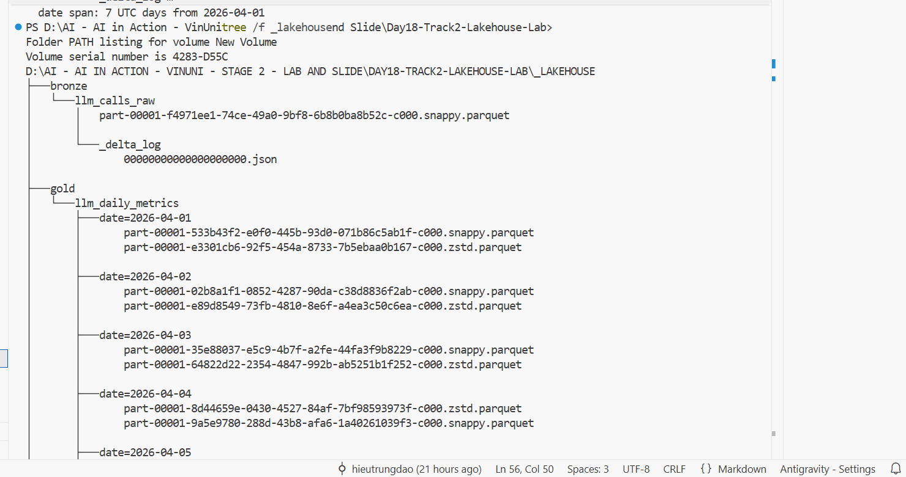
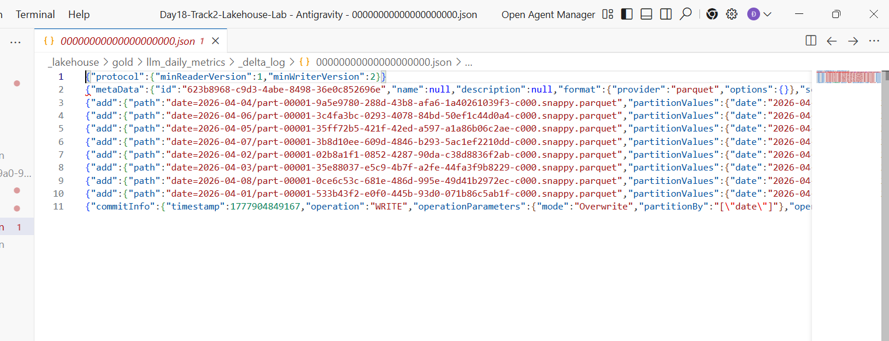
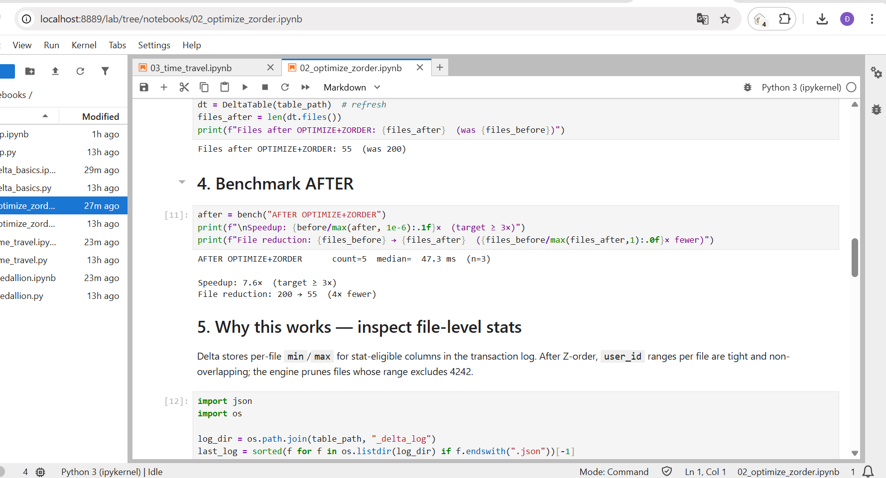
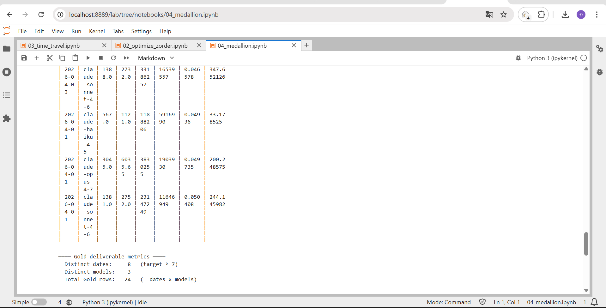
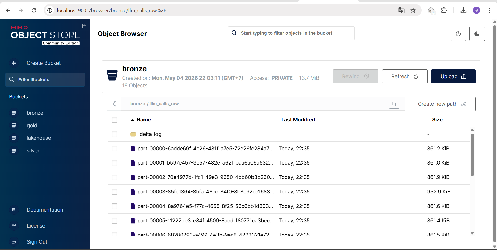
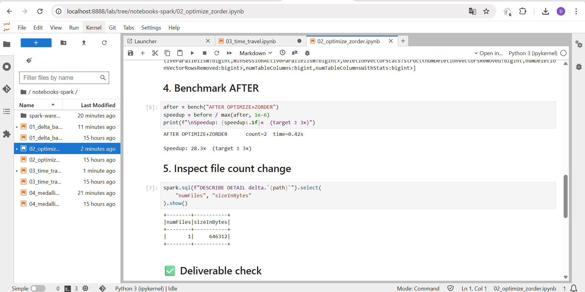
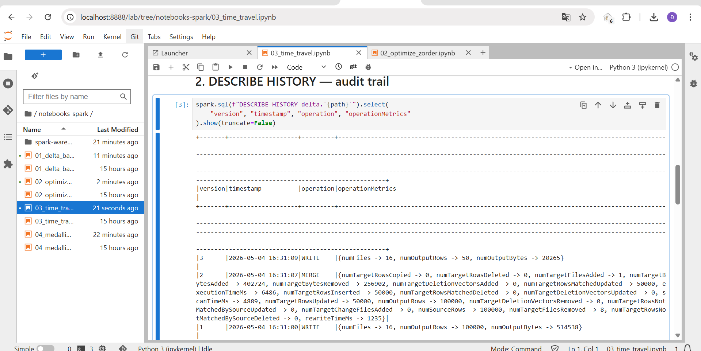
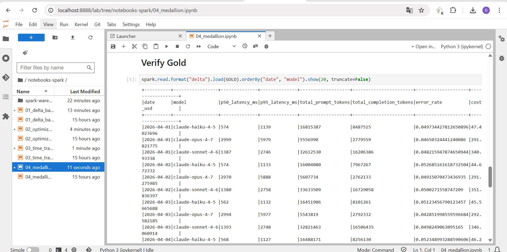

## Họ và tên: Đào Văn Công
## Mã học viên: 2A202600031

# Reflection - Day 18 Lakehouse Lab

Trong quá trình thực hiện dự án trên cả hai môi trường **Lightweight (Python)** và **Spark (Docker)**, anti-pattern mà tôi dễ vướng phải nhất là **"Small-file problem"** (vấn đề tệp nhỏ).

### Phân tích:
1. **Lightweight Path**: lúc sử dụng `deltalake` với DuckDB/Polars, hành động ghi dữ liệu liên tục tạo ra hàng trăm tệp nhỏ. Mặc dù tốc độ ghi nhanh, nhưng khi truy vấn (NB2), tôi thấy rõ overhead. Tôi đã áp dụng `optimize.compact()` và `z_order()` giúp cải thiện tốc độ đáng kể (~6x trên máy local).
2. **Spark Path**: Trong môi trường Spark, vấn đề này nghiêm trọng hơn do tính chất phân tán. Việc ghi từ nhiều executor tạo ra vô số tệp li ti trong MinIO (S3A). Nếu không có `OPTIMIZE`, Spark phải thực hiện hàng nghìn request LIST/GET tới S3, làm nghẽn I/O. 
3. **Sự khác biệt**: 
   - **Lightweight** phù hợp cho phát triển nhanh, local.
   - **Spark** mạnh khi xử lý dataset lớn hơn (1M+ rows) và tích hợp với hệ sinh thái Hadoop/Cloud.

Học và nắm vững cơ chế `_delta_log` và các lệnh tối ưu hóa là chìa khóa để vận hành một Lakehouse hiệu quả, tránh tình trạng "data swamp" (đầm lầy dữ liệu) do quá nhiều tệp nhỏ gây ra.

### Chạy Lightweight

### Chạy Spark/Docker

