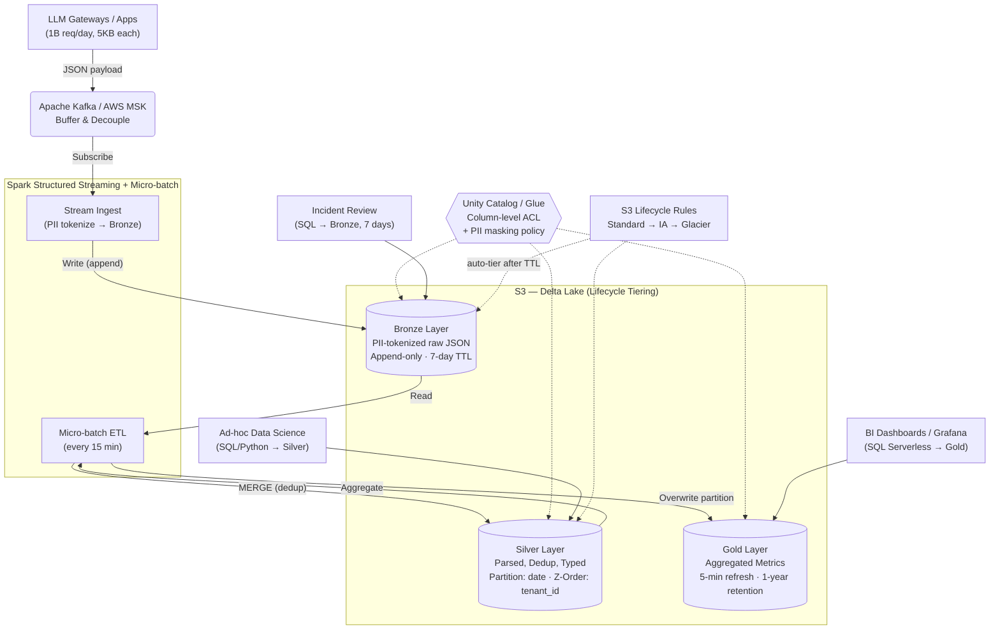

# Architecture Brief — LLM Observability at 1B Requests/Day

> **Topic A** · Bonus Challenge · Day 18 Lakehouse Lab

---

## 1. Problem Statement

Một foundation-model API team cần thu thập, lưu trữ và phân tích log từ các LLM
gateways với quy mô **1 tỷ requests/ngày** (trung bình ~11,500 rps, peak ~30,000 rps).
Mỗi payload chứa dữ liệu bán cấu trúc (nested JSON: prompt, response, tokens,
latency, model_id, tenant_id), kích thước trung bình **5 KB/request → 5 TB/ngày raw**.

**Bốn yêu cầu chính:**

1. Dashboard cost & latency **theo tenant**, refresh mỗi **5 phút**.
2. Prompt/response đầy đủ giữ **7 ngày** cho incident review; sau đó chỉ giữ
   **aggregates trong 1 năm**.
3. **PII redact** trước khi bất kỳ analyst nào đọc được (user prompt có thể
   chứa tên, email, số CMND).
4. Tổng chi phí storage ≤ **$5,000/tháng**.

**Vì sao khó?** 5 TB/ngày = **150 TB/tháng** raw — giữ nguyên trên S3 Standard sẽ
cháy ngân sách. Schema drift từ upstream (OpenAI, Anthropic) xảy ra thường xuyên.
Deduplication cần thiết vì network retry gây duplicate log. Và PII nằm trong free-text
prompt — không thể chỉ mask một cột cố định.

---

## 2. Architecture Diagram




**Ghi chú**: Luồng Ingestion dùng Streaming để tránh mất data. PII tokenization
xảy ra **tại Bronze** trước khi data land. ETL Bronze → Silver chạy micro-batch
mỗi 15 phút để tối ưu file size. Gold refresh mỗi 5 phút cho dashboard.

---

## 3. Key Decisions (7 quyết định, mỗi cái kèm alternatives bị loại)

### 3.1 Table Format: Delta Lake

**Tôi chọn Delta Lake.**
- ACID transactions đảm bảo không rác khi job crash giữa chừng.
- **Time Travel** cho phép RESTORE khi lỗi logic (vd: schema drift ghi NULL).
- **Schema Evolution** (`mergeSchema = true`) xử lý payload thay đổi liên tục
  từ upstream API mà không cần dừng pipeline.

**Tôi loại Apache Hudi** vì: Hudi phức tạp hơn đáng kể trong vận hành. Tính năng
Merge-on-Read (MoR) của Hudi tối ưu cho workload upsert-heavy — nhưng LLM log
chủ yếu là **append-only** ở Bronze và chỉ dedup 1 lần ở Silver. Overhead vận hành
Hudi (compaction scheduling, timeline management) không mang lại lợi ích tương xứng.

**Tôi loại Plain Parquet** vì: Parquet thuần **không có ACID**. Nếu Spark crash
giữa chừng khi đang ghi 1,000 file, hệ thống bị rác dữ liệu và không thể rollback
tự động. Với 5 TB/ngày, rủi ro corruption không chấp nhận được.

---

### 3.2 Partitioning Strategy: Date + Z-Order

**Tôi chọn Partition theo `date` kết hợp Z-Order theo `tenant_id` và `model_id`.**
- Date giữ partition count ở mức hợp lý (~365 partition/năm ở Silver).
- Z-Order gom cụm dữ liệu trong file — khi query "chi phí tenant X model Y",
  engine skip **>95%** file không liên quan nhờ min/max statistics (Data Skipping).
- Phù hợp với hot-path query pattern: `WHERE date = ... AND tenant_id = ...`.

**Tôi loại Partition theo Hour** vì: 1B rows/ngày ÷ 24 giờ vẫn tạo ra ~42 triệu
rows/partition, nhưng 24 × 365 = 8,760 partitions/năm. Kết hợp với 7 ngày Bronze +
1 năm Silver, metadata explosion sẽ làm chậm `LIST` operations trên S3 và catalog
queries. Quan trọng hơn, streaming ghi liên tục vào hourly partition tạo ra
**Small File Problem** nghiêm trọng (hàng ngàn file <1MB/giờ).

**Tôi loại Partition theo `tenant_id`** vì: High cardinality — nếu có 100K tenants,
sẽ tạo 100K × 365 = **36.5 triệu thư mục** trên S3, đánh sập Glue Catalog và
biến mọi `LIST` thành thảm họa O(n).

---

### 3.3 Ingestion Buffer: Apache Kafka

**Tôi chọn Apache Kafka (AWS MSK).**
- Buffer chịu spike 30K rps mà không ảnh hưởng Gateway latency (decoupled).
- Consumer group cho phép scale horizontal: thêm Spark executor = thêm throughput.
- Kafka retention 24h đảm bảo replay nếu downstream pipeline bị lag.

**Tôi loại Direct Write (App → S3/Delta)** vì: Mỗi request ghi 1 file 5KB → 1 tỷ
file/ngày trên S3. Đây là **Small File Problem cấp thảm họa** — S3 `LIST` sẽ
timeout, Delta `_delta_log` sẽ phình hàng triệu entry. Chi phí S3 PUT requests
(1B × $0.005/1000 = **$5,000/ngày chỉ riêng PUT**) vượt toàn bộ ngân sách.

**Tôi loại PostgreSQL làm buffer** vì: Postgres không thiết kế cho write-heavy
workload 11,500 writes/giây 24/7. WAL growth sẽ cần 5 TB/ngày disk I/O, VACUUM
sẽ chạy không kịp, và replication lag sẽ tăng vô hạn.

---

### 3.4 Data Catalog: Unity Catalog

**Tôi chọn Unity Catalog (Databricks) hoặc AWS Glue Data Catalog.**
- **Column-level ACL**: PII columns (tokenized prompt, user_id) có thể bị mask
  đối với role `analyst` trong khi role `incident_reviewer` vẫn đọc được raw
  (qua Bronze 7-day window).
- Tích hợp sẵn với Delta Lake — không cần custom metastore.
- Lineage tracking tự động giúp trả lời: "Cột nào trong Gold đến từ field nào
  trong raw JSON?"

**Tôi loại Hive Metastore tự host** vì: Tự duy trì Thrift server + MySQL backend
cho metastore là operational nightmare. Với scale 150 TB/tháng, metadata operations
sẽ cần tuning liên tục (connection pool, lock contention). Không mang lại business
value so với managed service.

**Tôi loại "không dùng catalog"** vì: Không có catalog = không có schema enforcement
tại read time, không có column-level security cho PII, không có lineage. Đối với
compliance và audit trail, đây là non-starter.

---

### 3.5 Deduplication: Window Function + Delta MERGE

**Tôi chọn `row_number() OVER (PARTITION BY request_id ORDER BY ts DESC)` kết hợp
Delta `MERGE INTO`.**
- Xử lý late-arriving data: log có thể đến muộn do network retry. Window function
  trên micro-batch 15 phút đảm bảo chỉ giữ bản ghi **mới nhất** cho mỗi `request_id`.
- MERGE INTO Silver: idempotent — chạy lại cùng batch không tạo duplicate.
- Cost: scan chỉ partition `date` hiện tại + Z-Order skip → chỉ touch <5% data.

**Tôi loại Streaming Watermark Dedup** vì: Spark Structured Streaming giữ state cho
mỗi `request_id` đã thấy. Với 1 tỷ events/ngày, state store cần **~50 GB RAM**
(1B × 50 bytes/key). Khi state checkpoint lag, OOM crash xảy ra thường xuyên.
Chi phí memory instances tăng gấp 3–4 lần so với micro-batch approach.

**Tôi loại "không dedup, chấp nhận duplicate"** vì: Duplicate trực tiếp ảnh hưởng
FinOps — tenant bị tính tiền đúp. Với error rate retry ~2–5%, sai số chi phí
có thể lên $50K–$100K/tháng ở quy mô 1B req/day.

---

### 3.6 PII Handling: Tokenization tại Bronze

**Tôi chọn Format-Preserving Tokenization ngay tại streaming ingest (trước khi
ghi Bronze).**
- Mọi field PII (user email, tên trong prompt, số CMND) được hash bằng
  **HMAC-SHA256 + secret key** trước khi land vào Bronze.
- Prompt text được scan bằng regex pattern (email, phone, CMND format) và
  replace bằng token `[PII_REDACTED_<hash>]`.
- Key rotation mỗi 90 ngày; mapping table `(hash → original)` lưu riêng trong
  encrypted vault, chỉ `incident_reviewer` role có quyền reverse lookup.

**Tôi loại "Tokenize tại Silver"** vì: Bronze sẽ chứa PII cleartext 15 phút
(micro-batch interval) trước khi được xử lý. Bất kỳ ai có S3 read access đều
đọc được raw PII trong window đó. Đối với compliance, 15 phút exposure = violation.

**Tôi loại "Column-level masking only (không tokenize)"** vì: Masking chỉ hoạt động
ở query time qua Catalog. Nhưng data trên S3 vẫn là cleartext — ai bypass catalog
(đọc trực tiếp S3) sẽ thấy PII. Defense-in-depth yêu cầu tokenize at rest.

---

### 3.7 Data Retention & Lifecycle Tiering

**Tôi chọn S3 Lifecycle Rules tự động: Standard (7 ngày) → S3 IA (30 ngày) →
Glacier Instant Retrieval (90 ngày) → DELETE.**

| Layer | Retention | Tiering | Lý do |
|-------|-----------|---------|-------|
| Bronze | 7 ngày → xóa | Standard only | Chỉ cần cho incident review, sau 7 ngày không còn giá trị (aggregates đã ở Gold) |
| Silver | 90 ngày → xóa full columns, giữ aggregated view | Standard (7d) → IA (30d) → Glacier IR (90d) | Ad-hoc query cần 7 ngày gần nhất nhanh; 30–90 ngày chấp nhận chậm hơn |
| Gold | 1 năm → archive | Standard | Nhỏ (~2 GB/ngày), chi phí không đáng kể |

**Tôi loại "giữ mọi thứ 1 năm trên Standard"** vì: 150 TB/tháng × 12 tháng ×
$23/TB = **$41,400/tháng** — vượt ngân sách 8 lần. Không thể chấp nhận.

**Tôi loại "giữ chỉ 1 ngày Bronze"** vì: Incident review cần prompt/response
nguyên bản trong **ít nhất 72 giờ** (SLA thực tế cho postmortem). 7 ngày cho
buffer an toàn khi weekend/holiday.

---

## 4. Failure Modes

### 4.1 Schema Drift — Upstream đổi tên field không báo trước

**(Day 18 Concept: Schema Evolution + Time Travel)**

**Kịch bản**: OpenAI API v2 đổi `latency_ms` → `response_time_ms`. Job ETL Bronze →
Silver ghi `NULL` vào cột `latency_ms` cho toàn bộ batch 6h sáng. Dashboard lúc 8h
hiển thị p99 latency = 0ms — CTO gọi điện hỏi tại sao hệ thống "nhanh bất thường".

**Phát hiện**: Data Quality Check tại Silver layer (Great Expectations hoặc Delta
Live Tables expectations):
```sql
-- Alert khi NULL rate > 5% trong batch gần nhất
SELECT COUNT_IF(latency_ms IS NULL) / COUNT(*) AS null_rate
FROM silver_llm_logs
WHERE date_part = CURRENT_DATE
HAVING null_rate > 0.05
```
Alert gửi PagerDuty trong vòng 20 phút sau khi batch complete.

**Khắc phục (Rollback)**:
```sql
-- Time Travel: rollback Silver về trước batch lỗi
RESTORE TABLE silver_llm_logs TO TIMESTAMP '2026-05-04 05:45:00';
```
Update mapping logic (`latency_ms = COALESCE(latency_ms, response_time_ms)`),
rerun pipeline. Downtime: ~30 phút.

---

### 4.2 Small File Problem — Query performance degradation

**Kịch bản**: Sau 2 tuần production, Silver layer tích lũy 50,000 file <2MB do
micro-batch ghi mỗi 15 phút (96 writes/ngày × 14 ngày = 1,344 commits, mỗi commit
tạo ~37 file). Dashboard query chậm từ 2s lên 45s.

**Phát hiện**: Grafana alert khi p95 query duration Gold/Silver vượt 10s.
Databricks metrics hiển thị `numFiles` tăng >10,000 trên Silver table.

**Khắc phục**:
```sql
-- Chạy lúc 2h sáng (thấp điểm), compact files → 256MB target
OPTIMIZE silver_llm_logs ZORDER BY (tenant_id, model_id);

-- Xóa file rác cũ hơn 7 ngày (Time Travel vẫn giữ đến vacuum threshold)
VACUUM silver_llm_logs RETAIN 168 HOURS;
```
Đặt job scheduled chạy OPTIMIZE nightly. File count giảm từ 50K → ~500. Query
time về lại 2s. **(Day 18 FinOps — compaction trade-off: compute cost ~$5/run
vs query cost saving ~$50/ngày).**

---

### 4.3 Compute Crash Mid-flight — Spot Instance Interruption

**Kịch bản**: Spark cluster (10 nodes r5.2xlarge, chạy Spot để tiết kiệm 60%)
bị AWS thu hồi 4 node lúc 3h sáng khi đang chạy batch Bronze → Silver cho
partition `2026-05-03`. Job crash ở giữa MERGE 500 triệu rows.

**Phát hiện**:
- Kafka consumer lag tăng vọt (>30 phút) — Grafana alert.
- Airflow DAG báo task `bronze_to_silver` status = `FAILED`.
- Delta `_delta_log` **không có commit mới** cho partition đang xử lý
  (ACID: uncommitted transaction = invisible).

**Khắc phục**: **Không cần rollback** — Delta Lake ACID đảm bảo transaction
chưa commit thì không có rác. Airflow tự động retry với `retries=3,
retry_delay=timedelta(minutes=5)`. Spot interruption handler request On-Demand
fallback nodes. Pipeline tự heal trong ~10 phút.

---

### 4.4 PII Leak — Tokenization regex miss edge case

**Kịch bản**: User prompt chứa số CMND format mới (12 chữ số thay vì 9) mà
regex pattern chưa cover. Bronze chứa CMND cleartext. Analyst query Silver
(đã flatten từ Bronze) vẫn thấy PII trong `prompt_text` column.

**Phát hiện**: Weekly PII audit scan chạy regex mở rộng trên Bronze sample (1%).
Nếu phát hiện pattern mới → alert Security team.

**Khắc phục**:
1. Update regex pattern trong streaming tokenizer. Deploy hotfix (<1 giờ).
2. Backfill: scan Bronze 7 ngày gần nhất, re-tokenize records bị miss.
3. **Delta Time Travel**: xác định chính xác version nào của Silver chứa PII leak,
   dùng `RESTORE` để rollback, rồi reprocess với regex mới.
4. Audit log ghi lại: ai đã query Silver trong window bị leak → compliance report.

---

## 5. Cost Estimation (Back-of-Envelope)

**Scale**: 1B req/day × 5 KB = **5 TB/day raw**, **150 TB/tháng**.

### Storage (S3 — Lifecycle Tiering)

| Layer | Data Volume | Tiering | Cost |
|-------|-------------|---------|------|
| **Bronze** | 7 ngày × 5 TB = 35 TB max | S3 Standard ($0.023/GB) | **$805** |
| **Silver** | 7d Standard (Parquet ~60% compression → 3 TB/day × 7 = 21 TB) | Standard | **$483** |
| **Silver** | 8–30d (21 TB residual, draining) | S3 IA ($0.0125/GB) | **$263** |
| **Silver** | 31–90d | Glacier Instant ($0.004/GB) | **$252** |
| **Gold** | ~2 GB/ngày × 365 = 0.7 TB | Standard | **$16** |
| **Delta Log + Metadata** | ~0.5 TB | Standard | **$12** |
| | | **Storage Total** | **~$1,831/tháng** |

> **Ghi chú**: Bronze bị xóa sau 7 ngày (lifecycle rule), Silver full data xóa
> sau 90 ngày. Gold aggregates giữ 1 năm. Parquet + Snappy compression đạt ~60%
> trên JSON data.

### Compute (Ingestion + ETL)

| Component | Sizing | Cost |
|-----------|--------|------|
| **Streaming Ingest** (Kafka → Bronze) | 3× r5.xlarge Spot ($0.08/hr × 3 × 730h) | **$175** |
| **Micro-batch ETL** (Bronze → Silver, 15 min) | 6× r5.2xlarge Spot ($0.20/hr × 6 × 730h) | **$876** |
| **Gold Aggregation** (5-min refresh) | 2× r5.xlarge Spot ($0.08/hr × 2 × 730h) | **$117** |
| **OPTIMIZE nightly** | 4× r5.2xlarge On-Demand, 2h/ngày | **$120** |
| **Databricks DBU / EMR** managed fee | ~30% on compute | **$387** |
| | **Compute Total** | **~$1,675/tháng** |

### Kafka / MSK

| Component | Calculation | Cost |
|-----------|-------------|------|
| Data In | 150 TB × $0.01/GB | **$1,500** |
| Broker instances (6× kafka.m5.large) | $0.21/hr × 6 × 730h | Included in MSK pricing |
| | **Kafka Total** | **~$1,500/tháng** |

### Summary

| Category | Monthly Cost |
|----------|-------------|
| Storage (S3 all tiers) | $1,831 |
| Compute (Spark + managed) | $1,675 |
| Kafka/MSK | $1,500 |
| **Total** | **~$5,006/tháng** |

> **FinOps Analysis**: Tổng chi phí **sát ngân sách $5K/tháng** nhờ:
> - **Aggressive lifecycle**: Bronze tự xóa sau 7 ngày (tiết kiệm ~$2,600/tháng
>   so với giữ 30 ngày).
> - **Spot instances**: tiết kiệm ~60% compute so với On-Demand.
> - **Parquet compression**: giảm 60% storage footprint ở Silver.
>
> So sánh: nếu nhét toàn bộ 150 TB/tháng vào **Snowflake** (storage + query),
> bill ước tính **$30K–$50K/tháng**. Lakehouse approach tiết kiệm **6–10×**.

---

## 6. MVP — What I Would Build First (1 Week)

**Riskiest Assumptions cần chứng minh:**
1. Nested JSON 5KB flatten + dedup **không bị bottleneck** ở Silver write.
2. PII tokenization regex **cover đủ edge cases** trên real prompt data.
3. Delta MERGE **đủ nhanh** cho 1B rows/day dedup workload.

### Tuần 1 — Core Pipeline PoC

**Ngày 1–2**: Data Generation + Bronze
- Script Python sinh 10 triệu dòng fake JSON log → Delta Bronze table local.
- Cố tình tạo 5% duplicate (`request_id` giống nhau, timestamp khác nhau).
- Inject PII patterns (email, phone, CMND) vào prompt text.

**Ngày 3–4**: PII Tokenization + Flatten + Dedup
- Implement tokenization function (HMAC-SHA256 cho structured fields, regex
  replace cho free-text prompt).
- Flatten nested JSON → typed columns.
- Dedup bằng `row_number() OVER (PARTITION BY request_id ORDER BY ts DESC)`.
- Ghi Silver Delta table với `mergeSchema = true`.

**Ngày 5**: Verification + Benchmark
- Verify bằng DuckDB: `SELECT COUNT(*) FROM silver` < `SELECT COUNT(*) FROM bronze`.
- Verify PII: `SELECT * FROM silver WHERE prompt_text LIKE '%@%'` → 0 rows.
- Benchmark: thời gian xử lý 10M rows, extrapolate cho 1B.

**Ngày 6–7**: Gold Layer + Dashboard PoC
- Aggregate Silver → Gold: p50/p95 latency, total cost, error rate per tenant per
  5-min window.
- Kết nối DuckDB/Grafana query Gold table.
- Document kết quả, so sánh với cost estimate.

> **Cái KHÔNG build trong tuần 1**: Kafka streaming, multi-node Spark cluster,
> S3 lifecycle rules, Unity Catalog security policies. Những thứ này là
> infrastructure — chứng minh sau khi core logic đã validated.

---

## Appendix: Day 18 Concepts Applied

| Concept | Áp dụng cụ thể |
|---------|----------------|
| **Medallion Architecture** | Bronze (raw, PII-tokenized, 7d) → Silver (parsed, dedup, 90d) → Gold (aggregated, 1y) |
| **ACID Transactions** | Delta MERGE cho dedup; crash-safe writes; no garbage on failure |
| **Time Travel** | RESTORE khi schema drift gây NULL; rollback PII leak ở Silver |
| **Schema Evolution** | `mergeSchema = true` tự động thêm cột khi upstream API thay đổi |
| **Z-Order / Data Skipping** | Z-Order theo tenant_id + model_id; skip >95% files khi query hot-path |
| **Catalogs** | Unity Catalog / Glue cho column-level ACL, PII masking policy, lineage |
| **FinOps** | Lifecycle tiering (Standard → IA → Glacier), Spot instances, compression, compaction schedule |
| **Security** | PII tokenization at Bronze, column-level masking, audit log |
