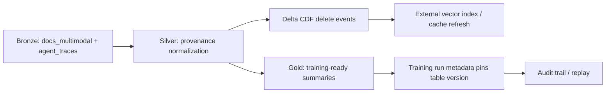

# Bonus Architecture Brief
## Topic: Provenance-Aware Multimodal Lakehouse for AI Observability

* **Data seed:** the lab's synthetic corpus from `scripts/generate_ai_data.py`
  - `docs_multimodal`: 2,000 multimodal docs with `subject_id`, `source`,
    `license`, `consent_train`, `generator`, `blob_uri`, `emb`
  - `agent_traces`: 300 multi-step sessions with `session_id`, `tool`,
    `latency_ms`, `reward`, `subject_id`
  - `blobs/`: 200 opaque media files referenced by URI
* **Goal:** make provenance and deletion first-class so the same lakehouse can
  answer:
  - which data can be used for training?
  - which exact table version trained a run?
  - can a subject be erased and proven erased?
  - can an external index be invalidated after delete?

---

## 1. Problem Statement

The lab corpus is small, but the failure modes are the same as production:

1. A multimodal corpus mixes internal, public, user-owned, and synthetic data.
2. Agent telemetry is append-heavy and must stay replayable by version.
3. Privacy requests need deterministic deletion with audit evidence.
4. Search indexes and caches become stale unless they are tied to table events.

The thin slice here uses the repo's own synthetic data as the seed and scales by
the same rule: preserve provenance at ingest, not after the fact.

---

## 2. Architecture

### Bronze
Keep the raw records and all provenance fields:

- `subject_id`
- `source`
- `license`
- `consent_train`
- `generator`
- `blob_uri`
- `session_id`

### Silver
Normalize into a table that is safe to train from:

- derive `provenance_bucket`
- tokenize `subject_id` deterministically
- partition by `provenance_bucket` or `agent_version`
- enable Change Data Feed so downstream systems can react to deletes

### Gold
Materialize only the summaries needed for:

- training allowlists
- policy dashboards
- deletion audits
- model-run reproducibility

---

## 3. Decisions

### Decision 1: Delta for mutable provenance state
I choose Delta Lake for Silver because deletes, CDF, and version pinning are the
core features the workflow needs. The point is not just ACID; it is the ability
to say "this run used table version N" and later replay that exact snapshot.

### Decision 2: Partition by provenance bucket, not by subject
I do not partition by `subject_id`. That would create a high-cardinality
partition anti-pattern and make deletes expensive. I partition by:

- `provenance_bucket` for docs
- `agent_version` for trajectories

That keeps pruning useful without exploding the directory tree.

### Decision 3: Embedding and payload travel together
For the multimodal docs, the embedding, URI, and provenance fields stay in the
same row. Splitting them early creates a join dependency that makes deletion and
audit harder.

### Decision 4: Every destructive action emits an event
Deleting a subject must emit:

1. a table delete
2. a CDF event
3. an index/cache invalidation
4. an audit record

If any one of those is missing, the system is only "logically" compliant.

### Decision 5: Version pinning is part of the model contract
The training job stores the table version in its metadata. That makes replay an
equality check, not a forensic reconstruction exercise.

---

## 4. Thin-Slice Runbook

### Ingest
1. Generate or load `docs_multimodal` and `agent_traces`.
2. Write Bronze tables.
3. Build Silver provenance tables.

### Train
1. Record the Silver table version in the run metadata.
2. Materialize Gold summaries.
3. Train only from the pinned snapshot.

### Erase
1. Resolve the subject token.
2. Delete the subject from Silver.
3. Read CDF delete events.
4. Rebuild the external index or mark it stale.

### Replay
1. Load the pinned table version.
2. Recompute the summary.
3. Compare against the original run metadata.

---

## 5. Cost Model

This thin slice is cheap by design:

- 2,000 docs and 300 sessions fit comfortably on local disk.
- CDF overhead is small at this scale.
- Rebuildable indexes are cheaper than complex delete-time patching.

The production scaling rule is simple:

- storage cost scales with corpus size
- compute cost scales with compaction and replay frequency
- audit cost scales with the number of destructive actions

That makes provenance design a FinOps decision, not just a compliance one.

---

## 6. Why This Is the Right Bonus

This bonus topic fits the lab's own data model:

- it uses the repo's synthetic multimodal corpus
- it uses the repo's agent traces
- it demonstrates version pinning and right-to-erasure
- it stays offline and reproducible

In other words, it is a production-shaped extension of NB7 and NB8 rather
than a separate toy problem.
