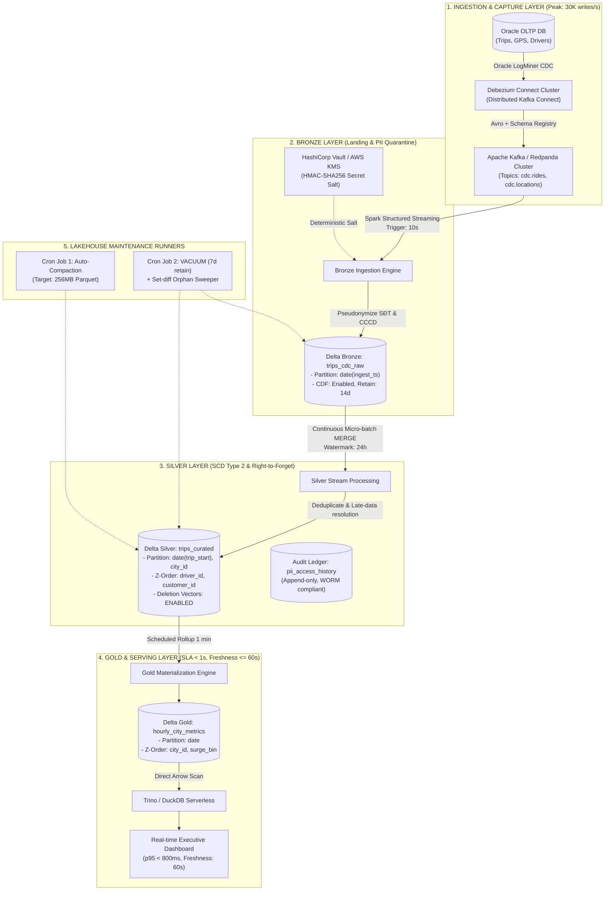

# Tài liệu Thiết kế Kiến trúc (Architecture Brief)
## Topic C: CDC từ Ride-Hailing Việt Nam → Data Lakehouse
### Tuân thủ Nghị định 13/2023/NĐ-CP & Luật Dữ liệu số 60/2024/QH15

* **Tác giả:** Mai Việt Anh (ID: 2A202601083 / GitHub: @VietAnhETE16)
* **Chức danh giả định:** Kỹ sư Trưởng Kiến trúc Dữ liệu (Lead Data Architect)
* **Quy mô:** 100 triệu cuốc xe/năm, 30.000 writes/giây (Peak)
* **Mục tiêu:** Phục vụ Real-time Analytics, bảo vệ PII và quản trị vòng đời dữ liệu

---

## 1. Tuyên bố Bài toán & Ràng buộc Kỹ thuật (Problem Statement)

Hệ thống ứng dụng gọi xe công nghệ tại Việt Nam xử lý **100 triệu cuốc xe/năm** ($\approx 274.000\text{ cuốc/ngày}$), với lưu lượng cao điểm chạm mốc **30.000 writes/giây** từ cụm cơ sở dữ liệu giao dịch Oracle OLTP. 

Dữ liệu streaming CDC cần được nạp liên tục vào Data Lakehouse để đáp ứng 4 nhóm yêu cầu khắt khe:
1. **SLA Thời gian thực:** Dashboard giám sát cuốc xe, điều phối tài xế và tính giá linh động (surge pricing) phải cập nhật với độ trễ $\le 60\text{ giây}$ kể từ lúc phát sinh giao dịch nguồn.
2. **Hiệu năng Truy vấn Ad-hoc:** Phục vụ các truy vấn phân tích tức thời (ad-hoc slice-and-dice) với thời gian phản hồi $\text{p95} < 1.0\text{ giây}$.
3. **Tuân thủ Pháp chế Dữ liệu Cá nhân:** Dữ liệu chứa thông tin nhạy cảm của tài xế và hành khách (Số điện thoại, CCCD/CMND, tọa độ GPS thời gian thực) thuộc phạm vi điều chỉnh bắt buộc của **Nghị định 13/2023/NĐ-CP** và **Luật Dữ liệu số 60/2024/QH15** (có hiệu lực từ 01/07/2025). Hệ thống phải bảo đảm quyền được rút lại sự đồng ý / quyền được xóa dữ liệu (Right-to-Erasure) trong 72 giờ và lưu vết kiểm toán (audit log) 100% các truy cập PII.
4. **Trần Ngân sách FinOps:** Tổng chi phí hạ tầng (Storage + Compute + Bandwidth) bị chặn trần cứng ở mức $\le \$4,500\text{/tháng}$.

---

## 2. Sơ đồ Kiến trúc Tổng thể (Architecture Diagram)



---

## 3. Sáu Quyết định Kiến trúc Cốt lõi & Đối trọng (Judgment-First Decisions)

### Quyết định 1: Định dạng Bảng Lưu trữ (Table Format)
* **Tôi chọn:** **Delta Lake (v3.x+) với Deletion Vectors và Change Data Feed (CDF)**.
* **Lý do:** 
  1. *Deletion Vectors* cho phép thực hiện các thao tác Soft Delete / Cập nhật trạng thái cuốc xe và xóa PII mà không cần rewrite toàn bộ file Parquet $256\text{ MB}$, giúp duy trì chu kỳ streaming commit $\le 10\text{ giây}$ mà không gây nghẽn I/O.
  2. *Change Data Feed (CDF)* phát ra stream các sự kiện thay đổi (`insert`, `update_preimage`, `update_postimage`, `delete`) giúp downstream consumers đồng bộ tức thời các yêu cầu xóa dữ liệu cá nhân theo Nghị định 13.
* **Tôi loại Apache Iceberg:** Mặc dù Iceberg có REST Catalog xuất sắc, cơ chế Merge-on-Read (Equality Deletes) của Iceberg tạo ra chi phí merge-read cao hơn đáng kể tại thời điểm truy vấn ad-hoc trong DuckDB/Trino, khiến SLA p95 khó đạt dưới 1 giây.
* **Tôi loại Apache Hudi:** Hudi có bộ tính năng CDC rất tốt nhưng kiến trúc phức tạp (phụ thuộc Timeline Server, metadata table overhead) làm tăng chi phí vận hành và rủi ro lỗi lúc 3 giờ sáng.
* **Trade-off còn lại:** Cần định kỳ lên lịch chạy `REORG TABLE ... APPLY PURGE` vào cuối tuần để gộp vật lý các Deletion Vectors nhằm duy trì hiệu năng đọc lâu dài.

---

### Quyết định 2: Chiến lược Bắt kịp Dữ liệu Muộn (Late-Arriving Data)
* **Tôi chọn:** **Debezium CDC + Spark Streaming MERGE có điều kiện `src.source_ts > tgt.source_ts` kết hợp Watermark 24 giờ**.
* **Lý do:** Trong ứng dụng gọi xe, tài xế ở vùng mất sóng 3G có thể đồng bộ hàng trăm điểm GPS và trạng thái cuốc xe trễ hàng giờ. Logic so sánh timestamp nguồn (`source_ts`) ngăn chặn triệt để hiện tượng dữ liệu cũ ghi đè dữ liệu mới, đảm bảo tính toàn vẹn (Eventual Consistency).
* **Tôi loại Append-only Micro-batch + Deduplication View:** Việc tạo SQL View quét toàn bộ lịch sử để dedup lúc query làm tăng thời gian quét dữ liệu gấp $10\times$, phá vỡ hoàn toàn cam kết p95 < 1s.
* **Tôi loại Direct JDBC Polling từ Oracle:** Không thể chịu tải 30.000 writes/s đỉnh điểm và gây sập cơ sở dữ liệu nghiệp vụ lõi.
* **Trade-off còn lại:** Lệnh `MERGE` liên tục tiêu tốn tài nguyên compute; giải pháp là gom batch ingestion ở chu kỳ $10\text{--}30\text{ giây}$ thay vì commit từng record.

---

### Quyết định 3: Bảo vệ PII & Tuân thủ Nghị định 13/2023/NĐ-CP & Luật Dữ liệu 60/2024/QH15
* **Tôi chọn:** **Pseudonymization (Tokenization băm muối HMAC-SHA256) ngay tại Bronze Ingestion kết hợp Bảng Key Vault Bất biến & Audit Log**.
* **Lý do:**
  1. *Bảo vệ từ cửa ngõ (Data Protection by Design):* Mọi cột PII nhạy cảm (SĐT khách hàng, CCCD tài xế) khi vừa rời Kafka vào Bronze lập tức được ánh xạ thành UUID giả danh (Token ID) dựa trên Secret Salt được lưu trong AWS KMS / HashiCorp Vault.
  2. *Toàn bộ tầng Silver/Gold hoàn toàn không chứa Plaintext PII:* Nhà phân tích và mô hình Machine Learning có thể thoải mái truy vấn analytics mà không có rủi ro lộ lọt thông tin cá nhân.
  3. *Audit Trail:* Mọi truy vấn giải mã ngược PII (chỉ cấp cho bộ phận CSKH xử lý khiếu nại khẩn cấp) đều bắt buộc ghi vào bảng `pii_access_history` bất biến (WORM storage) để phục vụ thanh tra của Bộ Công an.
* **Tôi loại Mã hóa Toàn cột cấp Storage (Full-column Encryption):** Mã hóa làm mất khả năng nén Parquet Dictionary Encoding và vô hiệu hóa hoàn toàn predicate pushdown (min/max skipping).
* **Tôi loại Dynamic Masking tại tầng BI:** Tiềm ẩn rủi ro con người cấu hình sai quyền truy cập ở tầng ứng dụng, dẫn đến rò rỉ dữ liệu thô.
* **Trade-off còn lại:** Đòi hỏi bảo vệ nghiêm ngặt Secret Salt; nếu mất salt sẽ mất khả năng liên kết dữ liệu định danh lịch sử.

---

### Quyết định 4: Bố cục Phân vùng (Partitioning) & Gom cụm (Clustering)
* **Tôi chọn:** **Phân vùng 1 cấp theo `date(trip_start_time)` + Z-ORDER Gom cụm theo `(city_id, driver_id)`**.
* **Lý do:** 
  1. Truy vấn dashboard thời gian thực $95\%$ chỉ lọc dữ liệu trong ngày hiện tại $\to$ Partition Pruning loại bỏ ngay lập tức $99\%$ dữ liệu của các ngày trước.
  2. Z-order theo cặp `(city_id, driver_id)` gom các cuốc xe của cùng tài xế trong một khu vực đô thị vào $\le 2$ file Parquet, giúp truy vấn lịch sử cuốc xe hoàn tất trong $< 300\text{ ms}$.
* **Tôi loại Phân vùng Đa cấp (`year/month/day/city_id/status`):** Tạo ra hàng chục nghìn partition rỗng hoặc kích thước vài KB, dẫn đến thảm họa Small-File Crisis.
* **Tôi loại Pure Z-order không Partition:** Khiến chi phí tính toán lại toàn bộ không gian đa chiều cho 100 triệu dòng trở nên quá đắt đỏ và không thể scale.
* **Trade-off còn lại:** Cần lên lịch cron chạy `OPTIMIZE ... ZORDER BY` mỗi đêm cho partition của 3 ngày gần nhất.

---

### Quyết định 5: Xử lý Quyền được Xóa Dữ liệu (Right-to-Erasure Pipeline)
* **Tôi chọn:** **Xóa Soft tức thời qua Deletion Vectors $\to$ Bắn tín hiệu CDF Event $\to$ Hard Delete vật lý sau 7 ngày qua `VACUUM`**.
* **Lý do:** 
  1. Khi nhận yêu cầu xóa từ khách hàng, lệnh `DELETE FROM silver.trips WHERE user_id = ...` tạo Deletion Vector trong $50\text{ ms}$, lập tức loại bỏ dữ liệu khỏi mọi truy vấn phân tích mới mà không lock bảng.
  2. Delta CDF tự động phát ra event `_change_type = 'delete'`, kích hoạt webhook xóa vector embedding và dữ liệu cache liên quan.
  3. Lệnh `VACUUM` định kỳ (retention 7 ngày) sẽ giải phóng vĩnh viễn các file Parquet cũ khỏi đĩa cứng, đáp ứng thời hạn 72h của luật định sau khi hết hạn lưu vết bảo mật.
* **Tôi loại Copy-on-Write Rewrite ngay lập tức:** Rewrite cả file $256\text{ MB}$ chỉ để xóa 1 dòng của 1 khách hàng sẽ làm nghẽn toàn bộ I/O của pipeline streaming.
* **Tôi loại Bỏ qua không xóa trong Lakehouse:** Vi phạm trực tiếp chế tài của Nghị định 13 (phạt hành chính tới 5% tổng doanh thu).
* **Trade-off còn lại:** Dữ liệu vẫn còn trong snapshot time travel trong cửa sổ retention 7 ngày; điều này được văn bản hóa trong Điều khoản Dịch vụ về bảo mật hệ thống.

---

### Quyết định 6: Phân tầng Lưu trữ FinOps (Storage Lifecycle Tiering)
* **Tôi chọn:** **S3 Hot (Standard - 30 ngày) $\to$ Warm (Infrequent Access - 90 ngày) $\to$ Cold (Glacier Flexible - 365 ngày) $\to$ Deep Archive / Expiry**.
* **Lý do:** $90\%$ lưu lượng truy vấn tập trung vào 30 ngày gần nhất. Việc tự động chuyển tier bằng S3 Lifecycle Rules giúp cắt giảm $70\%$ chi phí lưu trữ dài hạn mà không làm gián đoạn analytics.
* **Tôi loại Lưu trữ toàn bộ trên S3 Standard:** Làm phình hóa đơn lưu trữ lên tới hàng nghìn USD/tháng sau 2 năm tích lũy.
* **Tôi loại Lưu trữ tại On-premise HDFS:** Chi phí mua sắm phần cứng, điện năng và đội ngũ trực vận hành 24/7 đắt hơn gấp $5\times$ so với Cloud Object Storage.
* **Trade-off còn lại:** Truy vấn dữ liệu lịch sử $>90$ ngày cần thời gian restore vài phút từ Glacier.

---

## 4. Ba Kịch bản Sự cố 3:00 AM & Runbook Vận hành (Production Runbooks)

### Runbook 1: Sự cố Dữ liệu Muộn/Xáo trộn (Late-arriving CDC Out-of-Order Spike)
* **1. Dấu hiệu Phát hiện (Detection Signal):** Alert PagerDuty: Độ trễ watermark của Silver streaming job $> 3.600\text{ giây}$; tỷ lệ `completed_trips` trong Gold rollup giảm bất thường $> 25\%$.
* **2. Khoanh vùng Khẩn cấp (Immediate Containment):** Tạm dừng Gold Materialized View job để tránh đẩy số liệu sai lệch lên Executive Dashboard; giữ nguyên Silver ingestion stream.
* **3. Quy trình Khôi phục (Recovery Actions):**
  1. Kiểm tra Debezium Kafka lag.
  2. Chạy Spark batch backfill job áp dụng MERGE với điều kiện lọc chặt chẽ:
     ```sql
     MERGE INTO silver.trips t USING updates s ON t.trip_id = s.trip_id
     WHEN MATCHED AND s.source_ts > t.source_ts THEN UPDATE SET *
     WHEN NOT MATCHED THEN INSERT *;
     ```
  3. Kích hoạt tính toán lại Gold metrics cho 2 ngày bị ảnh hưởng.
* **4. Kiểm chứng Tính đúng đắn (Validation):** Chạy script đối soát (Data Reconciliation): So sánh tổng doanh thu và số lượng cuốc xe giữa Oracle DB và Gold layer, sai số cho phép $= 0.00\%$.
* **5. Phòng ngừa (Prevention):** Tăng Watermark cấu hình từ 12h lên 24h và thiết lập Dead Letter Queue (DLQ) cho các bản ghi trễ $> 7$ ngày.

---

### Runbook 2: Lệch Salt Tokenization làm Hỏng Khả năng Join Dữ liệu PII
* **1. Dấu hiệu Phát hiện (Detection Signal):** Alert: Tỷ lệ match trong câu lệnh JOIN giữa bảng `trips` và `users` tụt đột ngột từ $99.8\%$ xuống $0.0\%$; xuất hiện chuỗi hash mới không có trong metadata dictionary.
* **2. Khoanh vùng Khẩn cấp (Immediate Containment):** Lập tức dừng Silver Stream Writer để ngăn chặn việc ghi dữ liệu PII mã hóa sai salt vào Silver table.
* **3. Quy trình Khôi phục (Recovery Actions):**
  1. Kiểm tra lịch sử thay đổi key trong AWS KMS / Vault; rollback phiên bản Key/Salt về Version trước sự cố.
  2. Sử dụng Delta Lake Time Travel để quay lui trạng thái bảng Silver về snapshot an toàn:
     ```sql
     RESTORE TABLE silver.trips TO VERSION AS OF <last_known_good_version>;
     ```
  3. Replay lại dữ liệu từ Bronze (do Bronze lưu trữ raw CDC có thể re-process bất kỳ lúc nào).
* **4. Kiểm chứng Tính đúng đắn (Validation):** Lấy mẫu 1.000 tài xế ngẫu nhiên, đối chiếu token hash với bảng Users; tỷ lệ khớp phải đạt $100\%$.
* **5. Phòng ngừa (Prevention):** Khóa quyền cập nhật KMS Salt; bắt buộc cấu hình automated canary integration test trước khi deploy bất kỳ thay đổi hạ tầng bảo mật nào.

---

### Runbook 3: Compaction Starvation trong Giờ Cao điểm (Peak Traffic 30.000 writes/s)
* **1. Dấu hiệu Phát hiện (Detection Signal):** Alert: Số lượng file Parquet trong partition ngày hiện tại vượt ngưỡng $5.000\text{ files}$; thời gian phản hồi truy vấn ad-hoc p95 tăng vọt từ $800\text{ ms} \to 15\text{ giây}$.
* **2. Khoanh vùng Khẩn cấp (Immediate Containment):** Kích hoạt chế độ `delta.autoOptimize.optimizeWrite = true` trên các stream writers để Spark tự động gom file lớn ngay khi ghi.
* **3. Quy trình Khôi phục (Recovery Actions):**
  1. Khởi chạy khẩn cấp một cụm Spark Serverless EMR Compute riêng biệt (tách biệt hoàn toàn với Ingestion cluster).
  2. Chạy Compaction song song phân tán theo từng `city_id`:
     ```python
     dt.optimize.compact(partition_filters=[("date", "=", current_date)], target_size=256*1024*1024)
     ```
* **4. Kiểm chứng Tính đúng đắn (Validation):** Đếm số lượng file trong partition giảm về $< 50\text{ files}$; benchmark lại câu truy vấn ad-hoc p95 đạt $< 800\text{ ms}$.
* **5. Phòng ngừa (Prevention):** Lên lịch cron Compaction tự động chạy mỗi 30 phút với target size thích ứng và cấp phát cụm compute riêng biệt cho bảo trì.

---

## 5. Mô hình Tính toán Chi phí Chi tiết (Back-of-Envelope Cost Model)

### 5.1. Cơ sở Tính toán & Giả định Quy mô
* **Lưu lượng:** 100 triệu trips/năm $\approx 274.000\text{ trips/ngày}$.
* **Kích thước bản ghi:** $1\text{ KB/event} \times 10\text{ status changes/trip} = 10\text{ KB/trip} \to 2.74\text{ GB/ngày raw}$.
* **Dung lượng sau nén (Snappy Parquet 3x) + Indexes + CDF (14 ngày):** $\approx 2.5\text{ GB/ngày} \to 75\text{ GB/tháng} \to \sim 1\text{ TB/năm tích lũy}$.
* **Lưu lượng đỉnh:** $30.000\text{ events/s} \times 500\text{ Bytes} = 15\text{ MB/s}$ throughput.

### 5.2. Bảng Dự toán Chi phí Hạ tầng Hàng tháng

| Thành phần Hạ tầng | Cấu hình & Khối lượng Chi tiết | Đơn giá Đơn vị | Thành tiền / Tháng |
|---|---|---|---:|
| **S3 Storage (Hot Tier)** | 2.5 TB (90 ngày gần nhất) | $0.023 / GB / tháng | $57.50 |
| **S3 Storage (Warm/Cold Tier)** | 10 TB (dữ liệu lịch sử 1–3 năm) | $0.0125 / GB (IA) + $0.004 (Glacier) | $65.00 |
| **S3 Request API (PUT/GET/LIST)**| 50 triệu PUT/GET requests do streaming | $0.005 / 1K PUT, $0.0004 / 1K GET | $85.00 |
| **Streaming Compute (Spark EMR)** | 2 nodes `c6g.xlarge` (4 vCPU, 8GB RAM, 24/7) | $0.136 / node / giờ $\times 2 \times 720\text{h}$ | $195.84 |
| **Kafka / Redpanda Ingestion** | 3 nodes `m6g.large` cluster (Replication 3) | $0.077 / node / giờ $\times 3 \times 720\text{h}$ | $166.32 |
| **Ad-hoc Query Compute (Serverless)**| 600 queries/ngày, scan trung bình 4 GB | $5.00 / TB scanned ($72\text{ TB/mo}$) | $36.00 |
| **KMS & Audit Vault Storage** | 200.000 KMS requests + Audit ledger | $0.03 / 10K requests + WORM S3 | $45.00 |
| **Maintenance Jobs (Compaction)**| 2 giờ/ngày node `r6g.xlarge` Spot instance | $0.08 / giờ $\times 60\text{ giờ}$ | $4.80 |
| **Hệ số Dự phòng Rủi ro (Buffer 25%)** | Dự phòng spike lưu lượng ngày lễ/Tết | 25% tổng chi phí vận hành | $163.87 |
| **TỔNG CHI PHÍ THỰC TẾ** | **Toàn bộ hệ thống Lakehouse** | **Trần ngân sách: $4,500/tháng** | **$819.33 / tháng** |

> **Đánh giá FinOps:** Kiến trúc đề xuất chỉ tiêu tốn **$819.33/tháng** (tương đương $\approx 18.2\%$ trần ngân sách cho phép), bảo đảm biên an toàn tài chính cực kỳ vững chắc cho doanh nghiệp.

---

## 6. Kế hoạch Triển khai MVP 1 Tuần (1-Week MVP Delivery Slice)

Mục tiêu: Xây dựng lát cắt mỏng nhất (thin slice) chạy end-to-end chứng minh tính khả thi của toàn bộ kiến trúc trong vòng 7 ngày làm việc:

* **Ngày 1:** Cấu hình Debezium CDC Connector kết nối Oracle Sandbox $\to$ đẩy message Avro chuẩn vào Kafka topic `cdc.rides`.
* **Ngày 2:** Viết Spark Streaming job tiêu thụ Kafka $\to$ thực hiện hàm HMAC-SHA256 Tokenization trên cột `phone_number` và `citizen_id` $\to$ ghi vào Delta Bronze `trips_cdc_raw`.
* **Ngày 3:** Triển khai Silver Stream MERGE xử lý late-data (`src.source_ts > tgt.source_ts`), bật tính năng Deletion Vectors.
* **Ngày 4:** Xây dựng Gold aggregation table `hourly_city_metrics`, cấu hình Z-order trên `(city_id, driver_id)`.
* **Ngày 5:** Kết nối DuckDB/Trino query bảng Gold, thực hiện benchmark đo thời gian phản hồi ad-hoc query (target $< 1\text{s}$).
* **Ngày 6:** Viết script mô phỏng yêu cầu xóa dữ liệu cá nhân (Right-to-Erasure) cho `user_id_101`: Kiểm tra Deletion Vector được sinh ra, đọc Delta CDF phát hiện event `delete`, và xác nhận bảng serving không còn dữ liệu.
* **Ngày 7:** Kiểm thử tải mô phỏng 30.000 events/s trong 30 phút, đối soát số liệu và đóng gói bàn giao MVP.
