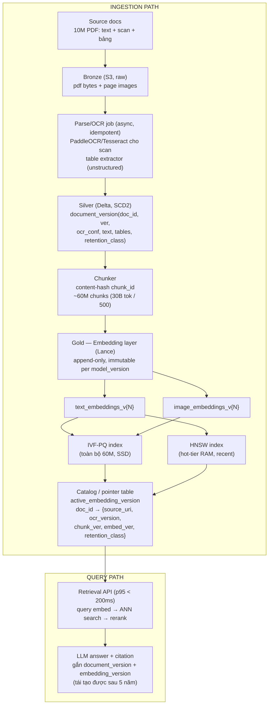

# Bio
Tên: Trần Hoàng Long

MSSV: 2A202601646

Track: 2

# 1. Problem statement
Một văn phòng luật ở Việt Nam cần RAG cho trên 10 triệu PDF (text, ảnh, bảng). Yêu cầu
- Embeddings sẽ được regenerate ít nhất 2 lần mỗi khi model được nâng cấp.  
- Search phải đạt P95 dưới 200ms trên ~30 tỷ token chunks. ~60 triệu chunk ở 500 token/chunk.
- Reproducibility 5 năm. Tức là mỗi khi retrieval một trích dẫn ở thời điểm N, thì hệ thống phải tái tạo chính xác ở thời điểm N+5, kể cả khi embedding có thay đổi. => Kiến trúc phải tách embedding phục vụ production với embedding dùng để tạo ra một trích cụ thể trong quá khứ. 

# 2. Architecture diagram

# 3. Quyết định chính, kèm alternatives đã loại
## Table format cho vector
Ở tầng gold, dùng Lance cho các bảng embedding vì nó có ANN index native
và columnar layout tối ưu cho random-access vector read. Delta sẽ được dùng ở tầng silver để   `document_version` và metadata. Delta được dùng ở tầng này vì metadata cần MERGE/ACID cho SCD2. Delta không được dùng cho vector vì Delta không có ANN index gắn liền sẽ phải ghép thêm vector DB ngoài dù sao, mất lợi thế "một hệ thống".

## Embedding versioning: append-only, immutable, không update in-place
Mỗi lần regenerate tạo bảng mới `embeddings_v{N}` theo `(model_id, model_version, chunk_hash)` sẽ không đụng vào bản cũ. Vì một bảng pointer `active_embedding_version` quyết định version nào phục vụ production. Không dùng update in-place vì nó sẽ vi phạm contract reproducibility vì một trích dẫn cũ sẽ ngầm trỏ sang vector khác mà không ai biết.

## Document/chunk identity: content-hash chunk_id, SCD2 cho document
`chunk_id = hash(normalized_text + layout_position)`. Mỗi lần văn bản bị chỉnh sửa sẽ tạo `document_version` mới. Không dùng auto-increment ID vì không reproducible qua các lần re-ingest. Điều này tức là nếu xài auto-increment ID thì mỗi lần re-ingest pipeline sẽ sing ra ID khác làm gãy liên kết citation. 

## Vector index: hybrid IVF-PQ (full corpus) + HNSW (hot-tier)
Với scale 60 triệu chunk, việc dùng brute-force/flat index sẽ không đạt đạt p95 < 200ms. Nếu HNSW cho toàn corpus thì kinh phí sẽ rất đắt. Cho nên, IVF-PQ hay compressed và disk/SSD-backed sẽ được dùng cho toàn bộ corpus. HNSW trong RAM sẽ được dùng cho tier "án lệ mới/tra cứu thường xuyên", nơi cần độ chính xác và latency thấp. 

## Multimodel layout: tách theo modality, join qua chunk_id
Raw PDF/ảnh scan ở Bronze (object storage). Text + bảng đã OCR ở Silver (Delta). Text-embedding và image-embedding là hai bảng Lance riêng ở Gold. Điều này giúp OCR model và text-embedding model có thể upgrade độc lập, không cần đồng bộ lockstep. Không gộp raw bytes + embedding vào một blob table, vì điều này buộc phải copy lại toàn bộ PDF khổng lồ mỗi lần chỉ regenerate embedding. 

## Catalog/governance: bảng pointer làm source-of-truth cho reproducibility
`document_id → {source_uri, ocr_version, chunk_table_version, embedding_version,
retention_class}` là nơi duy nhất định nghĩa "trạng thái nào đã sinh ra kết quả
retrieval này". Tôi loại dựa vào timestamp ingest để suy luận version (kiểu
"query theo thời gian") vì không robust. Nhiều job chạy song song, timestamp
không đảm bảo ánh xạ 1-1 với version cụ thể. Pointer table tường minh loại bỏ
nhập nhằng này.

# 4. Failure modes
## Pointer trỏ sai `active_embedding_version` sau upgrade.
- Detect: job build index kiểm tra hash `model_version` khớp với bảng embedding
trước khi flip pointer. Alert nếu lệch.
- Rollback: trỏ pointer về version cũ. Điều này diễn ra gần như tức thời vì version cũ vẫn nguyên vẹn (append-only).

## OCR garble văn bản pháp lý → sai trích dẫn.
- Detect: `ocr_conf` dưới ngưỡng được flag trong Silver, cộng audit sampling định
kỳ
- Rollback: quarantine document, retrieval fallback dùng ảnh gốc (không dùng
text OCR sai) cho tới khi review thủ công.

## Index build lỗi/half-built lúc chạy off-hours
- Detect: job build index chạy smoke-test recall trên một bộ golden query trước
khi swap "active" (blue/green); health check fail thì không swap
- Rollback: giữ nguyên index cũ đang serve, không có downtime.

## Schema evolution phá downstream
- Detect: Delta schema enforcement chặn ở CI trước khi merge vào Silver.
- Rollback: Delta time travel về schema version trước, backfill cột mới offline
rồi mới promote lại.

## Cron misfire trigger regenerate toàn bộ embedding ngoài kế hoạch
- Detect: cost-anomaly alert khi spending vượt ngưỡng bất thường
- Rollback: kill job, xoá partition version orphan. An toàn vì thiết kế append-only cô lập
blast radius vào đúng một version, không ảnh hưởng version đang production.

# 5. Ước lượng chi phí back-of-envelope
- OCR ~200 triệu trang (10M doc × ~20 trang). Tự host GPU ≈ $0.0005/trang
  → **~$100K/lần full-run** (chi phí burst, không phải hàng tháng)
- Raw storage: 10M PDF × ~2MB ≈ 20TB, cold tier $0.01/GB-tháng → **~$200/tháng**
- Silver (text + bảng đã OCR) ≈ 2TB, Delta trên S3 standard $0.023/GB
  → **~$46/tháng**
- Embedding storage: 60M chunk × 4KB (1024-dim fp32) = 240GB/version; giữ 3
  version cho reproducibility ≈ 720GB → **~$17/tháng** (rẻ vì chỉ là storage,
  không phải serving)
- Serving cluster (IVF-PQ + HNSW hot-tier, HA 3 node, ~32GB RAM/node)
  → **~$600–900/tháng**
- **Tổng: ~$1–2K/tháng**, cộng burst **~$100K mỗi lần regenerate
  toàn corpus** (đúng 2 lần theo yêu cầu đề bài). Con số này giải thích trực
  tiếp vì sao thiết kế append-only/versioned quan trọng. Vì regenerate không phải
  việc làm tuỳ tiện, mỗi lần là một quyết định $100K.

# 6. Bạn sẽ build cái gì trước (Slice MVP)
**Scope**: Hiện không có 10 triệu document, nên một subset nhỏ (50–100 văn
bản mẫu) đủ để dựng full path Bronze→Silver→Gold, và dồn toàn bộ effort vào
đúng phần rủi ro nhất của kiến trúc: cơ chế **embedding-version pointer +
reproducibility**

**Việc cần làm** trong notebook nếu có thời gian:
- Ingest subset nhỏ qua Bronze → Silver → chunker (content-hash `chunk_id`). Dùng OCR/parser thật cho vài chục PDF.
- Build `embeddings_v1` (Lance) + catalog/pointer table `active_embedding_version`.
- Dựng Retrieval API tối thiểu (query → ANN search → trả chunk kèm `embedding_version` pinned) để đo P95 thật trên subset.
- Từ API này, ghi lại một "citation record" thật (mô phỏng một trích dẫn án lệ thật tại thời điểm N).
- Regenerate `embeddings_v2` (đổi model), flip pointer, rồi chứng minh: (1) production trả kết quả mới, và (2) citation cũ vẫn reproducible khi pin về `embedding_version=v1`.

