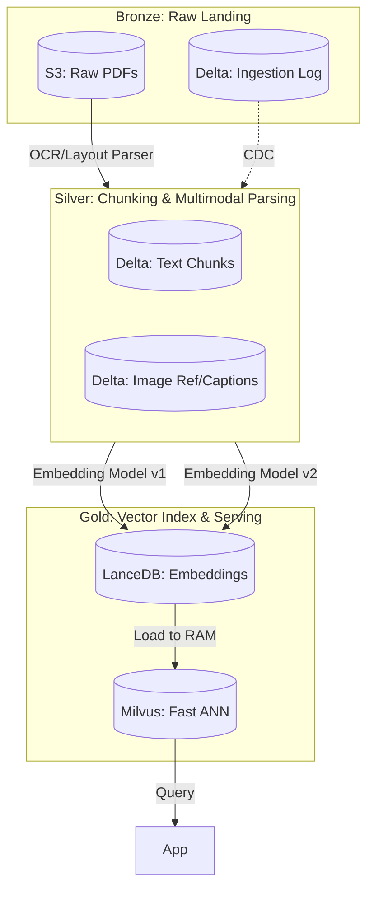

# Design Review: Multimodal RAG cho 10 triệu tài liệu pháp lý

## 1. Problem Statement
**Goal:** Xây dựng một hệ thống RAG mạnh mẽ, có khả năng mở rộng (scalable) và phân phiên bản (versioned) trên 10 triệu tài liệu pháp lý (PDF chứa văn bản, ảnh quét và bảng biểu) cho một văn phòng luật tại Việt Nam.
**Scale & Constraints:** 
- 10 triệu file PDF ≈ 30 tỷ token chunks.
- Embeddings sẽ được tái tạo ít nhất hai lần trong quá trình nâng cấp model.
- p95 search latency < 200 ms.
- **Yêu cầu quan trọng (Reproducibility):** Khi một vụ án trích dẫn một phiên bản tài liệu cụ thể, quá trình retrieval phải trả về kết quả chính xác giống hệt sau 5 năm, ngay cả khi embedding model hoặc vector index đã thay đổi.

## 2. Architecture Diagram

## 3. Key Decisions & Rejected Alternatives

### Decision 1: Storage Format cho Text và Metadata
- **Lựa chọn:** **Delta Lake**. Delta cung cấp time-travel, ACID transactions, và schema evolution. Điều này rất quan trọng cho yêu cầu reproducibility trong 5 năm (`versionAsOf`).
- **Alternative bị loại:** *Raw Parquet files*. Bị loại vì việc quản lý mutability (xóa/cập nhật cho việc chỉnh sửa pháp lý) và time-travel trên raw Parquet cực kỳ dễ xảy ra lỗi và phức tạp.

### Decision 2: Vector Storage & Indexing
- **Lựa chọn:** **LanceDB** để lưu trữ sâu các vectors + **Milvus** (với IVF_PQ) để phục vụ (serving). LanceDB được xây dựng cho multimodal AI và phân phiên bản vectors cùng với metadata, cho phép chúng ta giữ các phiên bản của embeddings. Milvus xử lý latency p95 dưới 200ms.
- **Alternative bị loại:** *Delta Lake + pgvector*. Delta không hỗ trợ native cho fast ANN search cho 30 tỷ vectors. pgvector không thể mở rộng đến 30 tỷ vectors với p95 < 200ms nếu không có mở rộng dọc (vertical scaling) khổng lồ và đắt đỏ.

### Decision 3: Multimodal Extraction
- **Lựa chọn:** **Unstructured.io / LayoutLMv3**. Trích xuất văn bản, bảng và hình ảnh riêng biệt. Hình ảnh được chuyển qua một Vision-Language Model (VLM) như LLaVA để tạo captions, sau đó được chunked và embedded cùng với văn bản.
- **Alternative bị loại:** *Basic PyPDF2 text extraction*. Bị loại vì các tài liệu pháp lý chứa các chữ ký quét và bảng biểu quan trọng. Việc bỏ qua hình ảnh/bảng sẽ phá hủy giá trị ngữ nghĩa của các tài liệu pháp lý.

### Decision 4: Embedding Lifecycle & Versioning
- **Lựa chọn:** **Thêm các cột mới cho embeddings mới** trong LanceDB/Delta thay vì ghi đè. Ví dụ: `embedding_v1`, `embedding_v2`. Khi nâng cấp, chúng ta tính toán `embedding_v2` cho tất cả các chunks trong background. Ứng dụng có thể chuyển sang `v2` một cách liền mạch. Để đạt được reproducibility trong 5 năm, các truy vấn trích dẫn các vụ án cũ sẽ yêu cầu rõ ràng `embedding_v1` và trạng thái index tại timestamp đó bằng cách sử dụng Delta's Time Travel.
- **Alternative bị loại:** *Ghi đè (overwriting) cột embedding*. Bị loại vì việc ghi đè phá vỡ yêu cầu reproducibility trong 5 năm. Bạn không thể truy vấn trạng thái cũ của các vectors nếu không có full time-travel, và việc time-travel 30 tỷ mảng float 1024 chiều bị ghi đè sẽ tạo ra sự phình to lưu trữ khổng lồ (write amplification).

### Decision 5: FinOps và Cold Storage
- **Lựa chọn:** **S3 Intelligent-Tiering** cho lớp lưu trữ Delta/Lance bên dưới. Các phiên bản cũ của embeddings (ví dụ: `v1` sau khi `v3` được phát hành) hiếm khi được truy cập sẽ được chuyển sang Infrequent Access.
- **Alternative bị loại:** *Giữ tất cả 30 tỷ vectors trong RAM/SSD vĩnh viễn*. Bị loại vì việc lưu trữ nhiều phiên bản của 30 tỷ vectors (khoảng 120GB cho mỗi 1 tỷ vectors tại 1024-dim float32 = 3.6TB mỗi phiên bản) trong RAM/NVMe nóng sẽ cực kỳ tốn kém.

## 4. Failure Modes & Rollback

- **Failure 1: Embedding Contamination / Buggy Model Upgrade.**
  - *Kịch bản:* `embedding_v2` mới tạo có hiệu suất retrieval kém do lỗi tokenizer được phát hiện sau 2 ngày.
  - *Phát hiện:* Các chỉ số retrieval-eval tự động giảm xuống dưới ngưỡng trong quá trình giám sát CI/CD.
  - *Rollback:* Chuyển API routing flag quay lại `embedding_v1`. Xóa cột `embedding_v2` bằng cách sử dụng Delta's `ALTER TABLE DROP COLUMN` và thu hồi không gian bằng `VACUUM`.

- **Failure 2: Corrupted PDF Ingestion.**
  - *Kịch bản:* Một đợt 50,000 file PDF có quá trình OCR bị lỗi, dẫn đến các text chunks rác.
  - *Phát hiện:* Kiểm tra chất lượng dữ liệu (ví dụ: regex cho legal boilerplate, language detection) thất bại trên bảng Silver.
  - *Rollback:* Sử dụng Delta Time Travel để `RESTORE` bảng Silver về phiên bản ngay trước khi quá trình ingestion bị lỗi. Chạy lại ingestion với OCR engine đã được sửa.

- **Failure 3: Out of Memory trên ANN Index.**
  - *Kịch bản:* Việc thêm 10 triệu vectors mới khiến cluster Milvus bị OOM trong quá trình xây dựng HNSW graph.
  - *Phát hiện:* Cảnh báo Prometheus về việc khởi động lại pod và tăng đột biến bộ nhớ.
  - *Rollback:* Chuyển sang sử dụng DiskANN hoặc IVF_PQ index thay vì HNSW tốn bộ nhớ, và mở rộng thêm các index nodes.

## 5. Ước tính chi phí (Back-of-envelope)

- **Storage (Delta/Lance trên S3):** 30 tỷ chunks. Text + Metadata ≈ 1 KB/chunk = 30 TB. Vectors (1024-dim fp16) = 2 KB/chunk = 60 TB. Tổng cộng mỗi phiên bản = 90 TB. 
  - S3 Standard: $0.023/GB * 90,000 GB ≈ **$2,070 / tháng** mỗi phiên bản.
- **Compute (Vector Database - Milvus):** 30 tỷ vectors yêu cầu ~60 TB. Sử dụng DiskANN (SSD-based index), chúng ta cần các instances với local NVMe (ví dụ: AWS `i4i.16xlarge` với 15TB NVMe). 
  - Cần 4-5 nodes. Chi phí ≈ $3.5/giờ * 730 giờ * 5 = **$12,775 / tháng**.
- **Ingestion/Compute (Databricks/Spark):** Ephemeral clusters. ≈ **$1,500 / tháng**.
- **Tổng chi phí ước tính:** **~$16,000 / tháng**. 

## 6. MVP (Tuần đầu tiên)

- **Goal:** Chứng minh khả năng multimodal ingestion và truy xuất vector theo phiên bản.
- **Phạm vi (Scope):** 
  1. Lấy 1,000 file PDF pháp lý đa dạng.
  2. Triển khai trích xuất từ Bronze sang Silver (text + table parsing).
  3. Ghi vào Delta Lake.
  4. Tạo `embedding_v1` bằng một model nhẹ (ví dụ: `bge-m3`) và lưu trữ trong LanceDB.
  5. Trình diễn một truy vấn trả về kết quả multimodal chính xác và cho thấy cách schema evolution thêm `embedding_v2` mà không làm gián đoạn `v1`.

