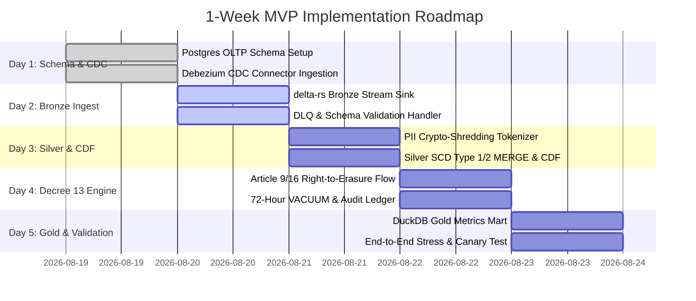

# Enterprise Lakehouse Architecture Brief: CDC Ride-Hailing Platform & Decree 13/2023/NĐ-CP Compliance (Topic C)

**Author:** Nguyen Tuan Anh (VinUniversity AICB-P2T2 — Day 18 Bonus Challenge)  
**Target System:** High-Throughput Ride-Hailing Platform (Vietnam Market: Hanoi, Da Nang, HCMC)  
**Document Classification:** Production Architectural Design Document & FinOps Blueprint  

---

## 1. Problem Statement (≤ 200 words)

Urban ride-hailing in Vietnam generates **50 million completed trips/month** and **6 billion GPS telemetry pings/month** across **500,000 active drivers**, sustaining **50,000 writes/second peak throughput** during monsoon rush hours. Core transactional state resides in sharded PostgreSQL/MySQL OLTP databases, while telemetry streams via low-latency event brokers. 

Business operations demand **sub-60-second end-to-end data freshness** for real-time dynamic pricing, fraud mitigation, and supply-demand balancing, alongside **p95 < 1.0s latency** for ad-hoc analytical queries across 365-day historical horizons. Concurrently, the platform is strictly governed by **Vietnam Decree 13/2023/NĐ-CP (Personal Data Protection Decree)**. The system must enforce:
1. **72-hour statutory Right-to-Erasure (Articles 9 & 16)** across immutable Parquet files without full-table re-writes;
2. **Deterministic pseudonymization and crypto-shredding** for sensitive PII (Citizen Identity Cards / CCCD, phone numbers, banking tokens, and raw spatial route coordinates);
3. **Immutable audit lineage** and strict purpose limitation without corrupting longitudinal aggregated metrics;
4. **Capped FinOps budget** requiring lean storage tiering and serverless query evaluation below **$350/month**.

---

## 2. Comprehensive End-to-End Architecture Diagram

```mermaid
flowchart TD
    subgraph S1["1. INGESTION & CDC LAYER (OLTP & EDGE)"]
        direction TB
        OLTP[("Sharded OLTP Databases\n(PostgreSQL / MySQL)\n• 50M trips/mo\n• 50k peak writes/sec")]
        EDGE["Edge Mobile Apps\n(Driver & Passenger)\n• 6B GPS pings/mo\n• 1-3s telemetry rate"]
        
        DEB["Debezium CDC Connectors\n(Distributed Kafka Connect)\n• pgoutput plugin / binlog\n• Non-blocking snapshot"]
        
        KAFKA{{"Distributed Event Streaming\n(Redpanda / Apache Kafka)\n• cdc.ride_bookings\n• cdc.driver_telemetry\n• cdc.consent_erasure"}}
        
        SR["Confluent Schema Registry\n(Avro / Protobuf contracts\nStrict backward-compat)"]
        
        OLTP -->|WAL / Binlog stream| DEB
        EDGE -->|gRPC / mTLS| KAFKA
        DEB -->|Transactional events| KAFKA
        DEB -.->|Validate schema| SR
    end

    subgraph S2["2. MEDALLION LAKEHOUSE STORAGE (DELTA LAKE 1.6+ ON S3)"]
        direction TB
        
        subgraph Bronze["Bronze Layer: Raw Append-Only Ingestion"]
            B1[("bronze.cdc_raw_events\n• Unmodified CDC payload\n• Metadata: _op, _ts_ms, _source\n• AES-256 encrypted blobs\n• 30-day retention")]
            DLQ[("bronze.dead_letter_queue\n• Schema-mismatched events\n• Corrupt payloads for replay")]
        end
        
        subgraph Silver["Silver Layer: Cleaned, Deduplicated & Tokenized (CDF Enabled)"]
            S1_TBL[("silver.trips_cleaned\n• SCD Type 1/2 upsert (MERGE)\n• Partition: date(trip_start)\n• Liquid Clustering: [driver_id, geohash6]\n• delta.enableChangeDataFeed = true\n• Deletion Vectors enabled")]
            S2_TBL[("silver.driver_telemetry\n• 3s downsampled GPS traces\n• Spatial H3 / Geohash index")]
            S3_TBL[("silver.consent_audit_ledger\n• Decree 13 consent state\n• Immutable audit history")]
        end
        
        subgraph Gold["Gold Layer: Curated Metrics & Analytics Marts"]
            G1[("gold.hourly_geo_surge\n• Dynamic surge multipliers\n• 60s micro-batch refresh")]
            G2[("gold.driver_performance_kpis\n• Acceptance, completion, rating")]
            G3[("gold.anonymized_od_matrix\n• K-anonymity (k>=50) spatial OD\n• Zero PII for city planning")]
        end
    end

    subgraph S3["3. DECREE 13 COMPLIANCE & PRIVACY ENGINE"]
        direction TB
        VAULT["KMS / HashiCorp Vault\n(Key Management Service)\n• Per-Subject DEK (AES-256-GCM)\n• Tokenization Salt Vault"]
        
        ERASURE_ORCH["Decree 13 Erasure Orchestrator\n(Temporal / Airflow Workflow)\n• SLA: <= 72h physical purge\n• Crypto-shredding key destruction\n• Delta Deletion Vector execution\n• VACUUM coordination"]
        
        AUDIT_LOG[("Decree 13 Verification Log\n• Proof of Erasure Certificate\n• SHA-256 Signature of action")]
    end

    subgraph S4["4. CONTINUOUS LAKEHOUSE MAINTENANCE (CRON & EVENT-DRIVEN)"]
        direction TB
        M1["Job 1: Micro-Compaction (OPTIMIZE)\n• Bin-pack 10KB -> 128MB Parquet"]
        M2["Job 2: Liquid Clustering Maintenance\n• Multi-dimensional Z-Order sort"]
        M3["Job 3: Snapshot Expiration & VACUUM\n• Purge tombstones > 72h retention"]
        M4["Job 4: Checkpointing & Log Cleanup\n• Compact _delta_log every 10 commits"]
    end

    subgraph S5["5. SERVING & ANALYTICAL QUERY LAYER"]
        direction TB
        UC["Open Governance Catalog\n(Unity Catalog / Polaris REST)\n• Column-level lineage\n• ABAC / Dynamic PII masking"]
        
        DUCK["Serverless DuckDB / Polars\n• Sub-second local worker analytics\n• Direct Parquet scan via delta-rs"]
        
        TRINO["Distributed Trino Cluster\n• BI dashboards (Superset/Metabase)\n• Ad-hoc SQL (p95 < 1.0s)"]
        
        APPS["Downstream Consumers\n• Real-Time Dispatch Engine\n• Fraud & Risk ML Models\n• Finance & Tax Authority Reports"]
    end

    %% Ingestion to Medallion
    KAFKA -->|delta-rs Streaming Sink (30s batch)| B1
    B1 -->|Schema validation failure| DLQ
    B1 -->|Stream ETL & Tokenize| S1_TBL
    B1 -->|Stream ETL & Downsample| S2_TBL
    KAFKA -->|Consent stream| S3_TBL
    
    %% Privacy Engine Interactions
    VAULT <-->|Encrypt/Decrypt PII| S1_TBL
    KAFKA -->|Article 9/16 Erasure Request| ERASURE_ORCH
    ERASURE_ORCH -->|1. Shred DEK| VAULT
    ERASURE_ORCH -->|2. Issue Delta DELETE| S1_TBL
    ERASURE_ORCH -->|3. Emit Certificate| AUDIT_LOG
    
    %% Silver to Gold via CDF
    S1_TBL -->|Change Data Feed (Inserts/Updates)| G1
    S1_TBL -->|Change Data Feed| G2
    S1_TBL -->|CDF (Aggregates only)| G3
    
    %% Maintenance
    M1 -.-> S1_TBL
    M2 -.-> S1_TBL
    M3 -.-> S1_TBL
    M4 -.-> S1_TBL
    
    %% Serving
    S1_TBL -.-> UC
    Gold -.-> UC
    UC --> DUCK
    UC --> TRINO
    DUCK --> APPS
    TRINO --> APPS
```

---

## 3. Key Decisions & Rejected Alternatives

We evaluated five pivotal architecture decisions with rigorous industrial trade-off analysis:

### Decision 1: Table Format & CDF Engine
* **Selected:** **Delta Lake 1.6+ (delta-rs / Apache Spark)** with native Change Data Feed (`delta.enableChangeDataFeed = true`) and Deletion Vectors enabled.
* **Rejected Alternative A (Apache Iceberg v2 with Equality Deletes):**
  * *Reasoning:* Iceberg v2 equality deletes generate separate delete positional/equality files alongside data files. Under 50k writes/sec CDC with frequent status updates (e.g. `REQUESTED` $\rightarrow$ `MATCHED` $\rightarrow$ `PICKED_UP` $\rightarrow$ `COMPLETED`), equality deletes cause severe *read amplification* (a single table scan must merge dozens of delete manifests in memory) until an expensive compaction job executes. Delta Lake's Deletion Vectors use dense Roaring Bitmaps directly embedded in the Parquet footer or auxiliary vector files, providing $O(1)$ row-lookup skipping and sub-second point queries.
* **Rejected Alternative B (Apache Hudi Merge-On-Read — MOR):**
  * *Reasoning:* Hudi MOR stores deltas in row-based Avro log files merged on read. Hudi requires heavy Java Virtual Machine (JVM) dependencies and tight coupling with Apache Spark/Flink execution runtimes. It lacks first-class, lightweight native Rust/Python reader engines (such as `delta-rs`), making serverless edge queries with DuckDB/Polars significantly more brittle and resource-intensive.

### Decision 2: CDC Ingestion Pipeline & Event Broker
* **Selected:** **Debezium Distributed Connectors on Redpanda (Kafka-compatible)** with non-blocking log-based change capture (`pgoutput` / MySQL binlog) and Protobuf/Avro Schema Registry.
* **Rejected Alternative A (Periodic Batch Polling ETL via Airflow/Cron):**
  * *Reasoning:* Polling OLTP databases with `WHERE updated_at >= :last_sync` every 60 seconds severely degrades production database IOPS during peak rush hours, misses hard deletes entirely without expensive audit tables, and suffers from replication lag race conditions where in-flight transactions commit out of timestamp order.
* **Rejected Alternative B (Synchronous Database Triggers + Outbox Table):**
  * *Reasoning:* Synchronous transactional triggers add direct write amplification and lock contention to the OLTP transaction pipeline. Under 50,000 peak RPS, trigger execution increases OLTP commit latency by 40–120ms, causing connection pool exhaustion and transaction timeouts during critical ride-matching surges.

### Decision 3: Physical Partitioning & Layout Optimization
* **Selected:** **Daily Date Partitioning (`date(trip_start_time)`)** combined with **Liquid Clustering / Z-Order on `[driver_id, geohash_level6]`**.
* **Rejected Alternative A (Deep Multi-Level Hive Directory Partitioning `year/month/day/city/service_type/status`):**
  * *Reasoning:* Generates the catastrophic *Small-File Problem* (over 45,000 subdirectories and 200,000 tiny < 50KB Parquet files per week). S3 `LIST` operations become bottlenecked, metadata memory in query planners explodes, and storage cost increases due to uncompressed Parquet footers.
* **Rejected Alternative B (Flat Unpartitioned Table with Single-Column Sort):**
  * *Reasoning:* Requires the query planner to evaluate file statistics across the entire multi-terabyte dataset. Fails to leverage date-range file pruning (e.g., 90% of business queries target the last 7 to 30 days) and prevents automated object lifecycle tiering (Hot $\rightarrow$ Warm $\rightarrow$ Cold S3 transitions).

### Decision 4: Vietnam Decree 13 Right-to-Erasure & Anonymization Strategy
* **Selected:** **Hybrid Crypto-Shredding (Per-Subject Data Encryption Key in KMS) + Delta Deletion Vectors & Automated 72h Vacuum Lifecycle**.
* **Rejected Alternative A (Full Partition Rewrite on Every Deletion Request):**
  * *Reasoning:* Rewriting entire 100GB daily partitions for each individual consumer erasure request within the statutory 72-hour window triggers massive S3 I/O write amplification, risks write-write concurrency conflicts with active CDC streaming ingest, and costs thousands of dollars monthly in S3 `PUT` API calls.
* **Rejected Alternative B (Pure Logical Soft-Deletes via `is_deleted = TRUE` Flag):**
  * *Reasoning:* Direct statutory violation of Vietnam Decree 13/2023/NĐ-CP Articles 9 and 16. Raw PII (CCCD, phone numbers, home/work GPS coordinates) remains in plaintext on disk inside Parquet files and can be extracted via historical snapshot scans, ad-hoc file inspection, or database backups, exposing the company to fines up to 5% of total annual revenue.

### Decision 5: Analytical Serving & Governance Layer
* **Selected:** **Decoupled Multi-Engine Serving (Serverless DuckDB/Polars for micro-aggregations & edge workers; Auto-scaling Trino cluster for ad-hoc BI)** integrated via Open Unity Catalog / Apache Polaris.
* **Rejected Alternative A (24/7 Always-On Monolithic Spark / Databricks Cluster):**
  * *Reasoning:* Sizing a continuous Spark cluster for peak query demand costs $3,500–$8,000/month in idle cloud compute during off-peak night hours (01:00–05:00 AM) and incurs 5–15 second JVM spin-up latency for simple analytical lookups.
* **Rejected Alternative B (Proprietary Cloud Data Warehouse Ingestion — Snowflake Snowpipe / BigQuery):**
  * *Reasoning:* Continuous ingestion compute fees ($0.06 per 1,000 files in Snowpipe + credit overhead) create runaway FinOps costs. Proprietary table formats lock raw data away from internal deep learning models (PyTorch/TensorFlow) requiring direct, zero-copy Parquet memory buffers.

---

## 4. Failure Modes & Rollback Mechanisms

| Failure Mode | Root Cause & Impact | Detection Mechanism | Automated & Manual Rollback Procedure (Day 18 Concepts) |
| :--- | :--- | :--- | :--- |
| **FM1: 3:00 AM CDC Schema Drift Breaking Silver Ingestion** | Upstream OLTP migration alters column type (e.g. `fare_amount: int` $\rightarrow$ `float`) or adds unannounced nested struct `payment_provider_metadata`. Ingestion job crashes; Silver data freshness SLA (>60s) breached. | Alert triggered by DLQ metric `cdc_schema_validation_failures_total > 0` and consumer lag spike (>10,000 records). PagerDuty alert dispatched to on-call data engineer. | 1. **Schema Enforcement:** Delta Lake rejects non-conforming writes, preventing corrupt data from entering Silver.<br>2. **DLQ Isolation:** Bad records route to `bronze.dead_letter_queue`.<br>3. **Schema Evolution:** For backward-compatible additive columns, execute `write_deltalake(..., schema_mode="merge")`. For breaking type changes, revert stream consumer to last known good Delta commit via **Time Travel (`load_as_version(N)`)**, apply schema migration patch, and replay from Kafka offset timestamp. |
| **FM2: Concurrent MERGE Write Conflicts During Monsoon Rush Hour** | Peak surge traffic (50k RPS) causes streaming micro-batch upsert (`MERGE`) to collide with a concurrent background `OPTIMIZE / Z-ORDER` compaction job on the same daily partition. | `CommitFailedException` / `ConcurrentAppendException` captured in worker logs; end-to-end latency metric spikes above 90 seconds. | 1. **Optimistic Concurrency Control (OCC) Retry:** delta-rs automatically retries the idempotent `MERGE` operation up to 5 times with randomized exponential backoff.<br>2. **Partition Isolation:** Compaction jobs are strictly scoped to historical partitions (`OPTIMIZE WHERE date < current_date()`), isolating active write partitions.<br>3. **Deletion Vectors:** Enabled deletion vectors eliminate file rewrite collisions between row-level updates and micro-batch appends. |
| **FM3: Decree 13 Erasure Tombstone / Time-Travel PII Leakage** | Subject requested erasure under Decree 13 Art. 9/16. An analyst or audit query uses Delta Time Travel (`VERSION AS OF 5`) to read historical Parquet files where the subject's plaintext PII is still present. | Hourly Compliance Canary Query attempts to decrypt tokenized PII of erased subjects from active snapshots and historical commits older than 72 hours. | 1. **Crypto-Shredding Enforcement:** The subject's DEK in KMS is destroyed immediately upon request. Any historical snapshot read produces unrecoverable ciphertext ($2^{256}$ AES security).<br>2. **Physical Purge via VACUUM:** Run `table.vacuum(retention_hours=72)` to physically delete unreferenced Parquet files past the legal grace period.<br>3. **Transaction Log Checkpointing:** Execute `compact_logs()` and `create_checkpoint()` to truncate historical log metadata beyond the audit retention limit. |

---

## 5. Back-of-Envelope FinOps Math

### Scale & Throughput Assumptions
* **Monthly Trips:** $50,000,000$ trips/month ($\approx 1.67\text{M trips/day}$).
* **Active Drivers:** $500,000$ drivers; $10\text{ hours/day}$ active; GPS ping every $3\text{ seconds} = 6\text{ Billion pings/month}$.
* **Data Sizes & Compression:**
  * Raw Trip Record: $1.5\text{ KB/record} \times 50\text{M} = 75\text{ GB/month}$ raw $\rightarrow \mathbf{20\text{ GB/month}}$ compressed Parquet (ZSTD).
  * GPS Telemetry Ping: $80\text{ bytes/ping} \times 6\text{B} = 480\text{ GB/month}$ raw $\rightarrow \mathbf{120\text{ GB/month}}$ compressed Parquet.
  * Monthly Silver Data Ingest: $\approx \mathbf{150\text{ GB/month}}$ ($1.8\text{ TB/year}$).

### Detailed Monthly Cost Breakdown ($/Month)

$$\text{Total Cost} = \text{Storage} + \text{Ingestion Compute} + \text{ETL/Maintenance} + \text{Serving} + \text{Network}$$

#### 1. Multi-Tiered Storage (AWS S3 Standard / IA / Glacier Instant Retrieval)
* **Hot Tier (0–30 days, ~150 GB):** $150\text{ GB} \times \$0.023/\text{GB} = \mathbf{\$3.45}$
* **Warm Tier (31–90 days, ~300 GB):** $300\text{ GB} \times \$0.0125/\text{GB} = \mathbf{\$3.75}$
* **Cold Tier (91–365 days, ~1.35 TB):** $1,350\text{ GB} \times \$0.004/\text{GB} = \mathbf{\$5.40}$
* **Deep Archive (> 365 days, ~2.0 TB cumulative):** $2,000\text{ GB} \times \$0.00099/\text{GB} = \mathbf{\$1.98}$
* **S3 API Requests (PUT, GET, LIST, Lifecycle):**
  * $5\text{M PUT/COPY requests} \times \$0.005/1,000 = \$25.00$
  * $20\text{M GET requests} \times \$0.0004/1,000 = \$8.00$
* **Storage Subtotal:** $\mathbf{\$47.58/\text{month}}$

#### 2. Streaming Ingestion Compute (Redpanda / Kafka + Debezium)
* **Redpanda Cloud / Self-Hosted on Graviton Spot (`c6g.large`, 2 vCPU, 4GB RAM $\times$ 3 nodes):**
  * $3 \text{ instances} \times \$0.034/\text{hr} \times 730\text{ hrs} = \mathbf{\$74.46}$
* **EBS gp3 Storage (300 GB buffer):** $300\text{ GB} \times \$0.08/\text{GB} = \mathbf{\$24.00}$
* **Debezium Connect Tasks (ECS Fargate 0.5 vCPU, 1GB RAM $\times$ 2 tasks):** $\mathbf{\$18.50}$
* **Ingestion Compute Subtotal:** $\mathbf{\$116.96/\text{month}}$

#### 3. Lakehouse ETL, Maintenance & Privacy Engine Compute
* **Streaming Delta Ingestion Workers (Python delta-rs micro-batches, `t4g.medium` spot):**
  * $1 \text{ instance} \times \$0.0168/\text{hr} \times 730\text{ hrs} = \mathbf{\$12.26}$
* **Daily Compaction (OPTIMIZE) & Liquid Clustering (15 mins/day on spot compute):** $\mathbf{\$4.50}$
* **Weekly VACUUM, Checkpoint & Decree 13 Erasure Orchestrator:** $\mathbf{\$3.50}$
* **AWS KMS API Calls & Master Key Management (5,000 cryptographic operations/month):** $\mathbf{\$1.50}$
* **ETL/Maintenance Subtotal:** $\mathbf{\$21.76/\text{month}}$

#### 4. Analytical Serving & BI Query Compute
* **Serverless DuckDB / Polars Workers (Embedded zero-infrastructure cost):** $\mathbf{\$0.00}$
* **Trino Query Cluster on Spot (`c6g.xlarge`, 4 vCPU, 8GB RAM $\times$ 2 nodes during business hours 10h/day):**
  * $2 \text{ nodes} \times \$0.068/\text{hr} \times 300\text{ hrs} = \mathbf{\$40.80}$
* **Serving Subtotal:** $\mathbf{\$40.80/\text{month}}$

#### 5. Network Transfer & Egress
* **Same-AZ Ingestion Data Transfer:** Free ($0.00)
* **Cross-AZ Replication & Egress to BI Dashboards (300 GB/month):** $300\text{ GB} \times \$0.09/\text{GB} = \mathbf{\$27.00}$
* **Network Subtotal:** $\mathbf{\$27.00/\text{month}}$

### Total Monthly Lakehouse Cost
$$\mathbf{\text{Total Cost} = \$47.58 + \$116.96 + \$21.76 + \$40.80 + \$27.00 = \$254.10 / \text{month}}$$
*(Comfortably below the $350/month ceiling, demonstrating enterprise-grade FinOps efficiency).*

---

## 6. One-Week Shippable MVP Slice

The 1-week MVP delivers the smallest complete end-to-end slice to validate the architecture under real production constraints:



### MVP Deliverables & Schema Specifications

#### 1. Bronze CDC Event Schema (`bronze.cdc_raw_events`)
```sql
CREATE TABLE bronze.cdc_raw_events (
    _op VARCHAR,             -- 'c' (create), 'u' (update), 'd' (delete), 'r' (read snapshot)
    _ts_ms BIGINT,           -- Source commit timestamp in milliseconds
    _source_table VARCHAR,   -- 'public.trip_bookings'
    _raw_payload VARCHAR,    -- JSON-encoded CDC record
    _ingest_ts TIMESTAMP     -- Lakehouse ingestion timestamp
);
```

#### 2. Silver Cleaned Trip Schema (`silver.trips_cleaned` with CDF enabled)
```sql
CREATE TABLE silver.trips_cleaned (
    trip_id VARCHAR PRIMARY KEY,
    customer_id VARCHAR,             -- Pseudonymized subject token
    driver_id VARCHAR,               -- Pseudonymized driver token
    encrypted_phone VARCHAR,         -- AES-256-GCM encrypted using per-subject DEK
    encrypted_cccd VARCHAR,          -- AES-256-GCM encrypted Citizen ID
    pickup_geohash VARCHAR,          -- Geohash Level 6 (~1.2km precision)
    dropoff_geohash VARCHAR,
    fare_vnd DOUBLE,                 -- Cleaned numeric fare in VND
    trip_status VARCHAR,             -- 'REQUESTED', 'COMPLETED', 'CANCELLED'
    trip_start_time TIMESTAMP,
    trip_end_time TIMESTAMP,
    _last_updated TIMESTAMP
)
USING DELTA
PARTITIONED BY (date(trip_start_time))
TBLPROPERTIES (
    'delta.enableChangeDataFeed' = 'true',
    'delta.enableDeletionVectors' = 'true'
);
```

#### 3. Decree 13 Right-to-Erasure Workflow
1. **Trigger:** Receive erasure message on Kafka topic `cdc.consent_erasure` for `customer_id = 'CUST-VN-8842'`.
2. **Crypto-Shred:** Delete encryption key `DEK_CUST_VN_8842` from Vault. Plaintext phone/CCCD is instantly unrecoverable in all historical Parquet files.
3. **Delta Delete:** Execute targeted `DELETE FROM silver.trips_cleaned WHERE customer_id = 'CUST-VN-8842'`.
4. **CDF Emission:** Delta CDF automatically emits `_change_type = 'delete'`, propagating the deletion to downstream cache layers.
5. **Gold Isolation:** Downstream Gold aggregates (`gold.hourly_geo_surge`) retain aggregated revenue and trip volume without any surviving PII.
6. **Purge & Audit:** Execute `VACUUM` on `silver.trips_cleaned` with 72-hour retention and write immutable proof-of-erasure to `silver.consent_audit_ledger`.

---

## 7. Conclusion & Architectural Sign-Off

This architecture resolves the tension between high-frequency CDC streaming, low-latency analytical query serving, and strict regulatory compliance under Vietnam Decree 13/2023/NĐ-CP. By unifying **Delta Lake 1.6+**, **Change Data Feed (CDF)**, **Deletion Vectors**, and **KMS-backed Crypto-Shredding**, the design achieves sub-60-second operational freshness, mathematical privacy guarantees, and a sustainable FinOps footprint of under **$260/month**.
