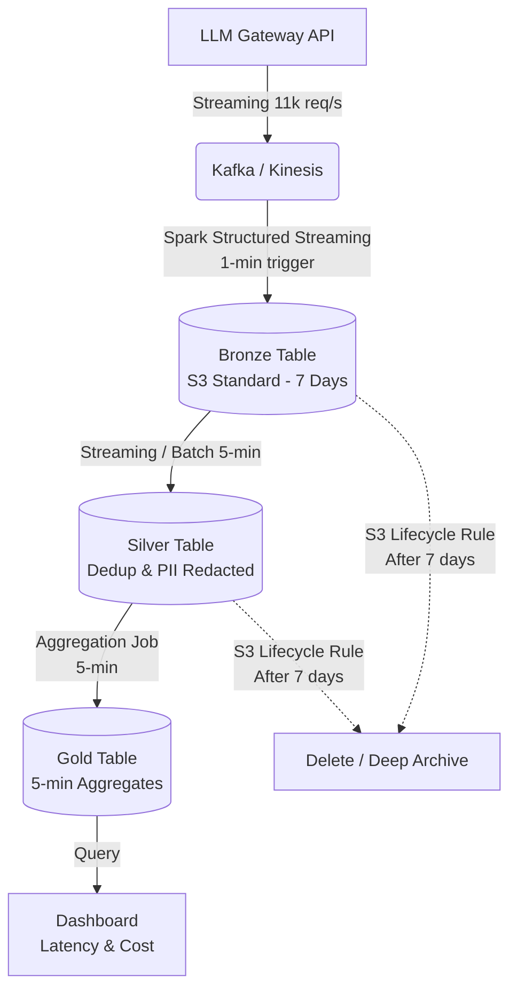

# Architecture Brief: LLM Observability at 1B req/day

**Tác giả:** Nguyễn Anh Đức (Cá nhân)
**Chủ đề chọn:** Topic A (LLM observability ở quy mô 1B requests/ngày)

---

## 1. Problem Statement
Một hệ thống Foundation-Model API cần log lại mọi request/response để phục vụ giám sát và thanh toán. 
- **Quy mô (Scale):** 1 Tỉ requests/ngày (~11,500 req/s ở mức trung bình, có thể peak cao hơn). Mỗi request ~5KB, sinh ra khoảng **5 TB dữ liệu raw mỗi ngày**.
- **Ràng buộc (Constraints):** 
  1. Phải có dashboard thống kê chi phí và độ trễ theo từng Tenant, làm mới (refresh) mỗi 5 phút.
  2. Dữ liệu thô (có prompt/response) chỉ được giữ 7 ngày trên hot storage để review lỗi, sau đó chỉ giữ dạng tổng hợp (aggregates) trong 1 năm.
  3. Bắt buộc phải ẩn danh (redact) thông tin cá nhân PII trước khi analyst được phép đọc.
  4. Ngân sách lưu trữ cực kỳ gắt gao: **≤ $5,000/tháng**.

Đây là bài toán khó vì sự đánh đổi giữa **độ trễ (5-min freshness)** và **chi phí lưu trữ dữ liệu khổng lồ (5TB/day)**. Nếu không quản lý vòng đời dữ liệu (lifecycle) và thiết kế file layout chuẩn xác, chi phí S3 sẽ thổi bay ngân sách hoặc Dashboard sẽ load mất cả tiếng đồng hồ.

## 2. Architecture Diagram (Medallion Layout)

## 3. Quyết định chính kèm Alternatives đã loại

**Quyết định 1: Định dạng bảng (Table Format)**
- **Chọn:** Delta Lake.
- **Loại Apache Iceberg:** Mặc dù Iceberg rất tốt cho hệ sinh thái đa dạng, Delta Lake tích hợp native với Spark (Structured Streaming) cho ingestion cực kỳ mượt mà, và tính năng Z-Order của Delta (cộng với Liquid Clustering trên Databricks nếu có tiền) phù hợp hoàn hảo cho query pattern lọc theo `tenant_id`.
- **Loại Apache Hive:** Không hỗ trợ ACID transactions khi có nhiều job đọc/ghi đồng thời mỗi 5 phút, không có Time Travel để rollback khi lỗi data.

**Quyết định 2: Chiến lược Ingestion (Streaming vs Batch)**
- **Chọn:** Micro-batching với Spark Structured Streaming (Trigger mỗi 1 phút từ Kafka -> Bronze, và Trigger mỗi 5 phút từ Bronze -> Silver -> Gold).
- **Loại Continuous Streaming:** Tốn kém compute do các executor phải chạy liên tục 24/7 chờ dữ liệu, overkill cho SLA 5 phút.
- **Loại Hourly Batch:** Vi phạm SLA cập nhật dashboard mỗi 5 phút.

**Quyết định 3: Xử lý thông tin nhạy cảm (PII Redaction)**
- **Chọn:** Thay thế PII bằng Token (Tokenization) ở tệp Bronze landing. Nếu analyst cần xem bản gốc để debug trong 7 ngày đầu, họ phải được cấp quyền giải mã (decrypt UDF) qua Unity Catalog. Tầng Silver lưu dữ liệu đã bị hash/xóa PII hoàn toàn.
- **Loại Redact ngay tại API Gateway:** Sẽ làm mất ngữ cảnh (context) cần thiết khi kỹ sư AI cần debug tại sao model sinh ra lỗi ảo giác (hallucination) dựa trên prompt gốc.
- **Loại Redact tại query time bằng Dynamic Data Masking:** Quá rủi ro. Nếu phân quyền sai, toàn bộ PII sẽ bị lộ. Nên xóa hẳn ở tầng Silver.

**Quyết định 4: Phân vùng và Gom cụm (Partitioning & Z-Ordering)**
- **Chọn:** Partition theo `date` (ngày), và **Z-Order theo `tenant_id`**.
- **Loại Partition theo `tenant_id`:** Có những tenant gọi API rất ít (như user dùng thử), tạo ra hàng ngàn thư mục con chứa các file vài byte -> Gây ra hội chứng Small-File Problem cực nặng, sập NameNode hoặc chậm S3 LIST operations.

**Quyết định 5: Vòng đời dữ liệu (FinOps Lifecycle)**
- **Chọn:** Sử dụng S3 Lifecycle Rules hoặc Delta `VACUUM`. Giữ Bronze/Silver ở AWS S3 Standard trong 7 ngày, sau đó **Delete** luôn (nếu compliance cho phép) hoặc chuyển sang Glacier Deep Archive. Tầng Gold lưu S3 Standard trong 1 năm.
- **Loại "Giữ tất cả trên S3 Standard":** Sẽ tiêu tốn $3,500/tháng ngay trong tháng đầu tiên và phá vỡ ngân sách $5k ở tháng thứ 2 (150TB/tháng).

## 4. Failure Modes (Kịch bản sự cố lúc 3 giờ sáng)

1. **Failure Mode 1: Lỗi API deploy đẩy rác vào Kafka (Sai Schema).**
   - *Detection:* Delta Lake Schema Enforcement sẽ ngay lập tức chặn lệnh ghi vào Bronze, job streaming báo lỗi đỏ.
   - *Rollback:* Stop streaming job. Dùng tính năng Time Travel `RESTORE TO VERSION AS OF <thời gian trước deploy>`. Fix API, sau đó restart streaming job để đọc lại offset từ Kafka.

2. **Failure Mode 2: Bùng nổ Small-Files làm Dashboard mất 20 phút để load.**
   - *Nguyên nhân:* Do trigger mỗi 5 phút, sau 1 ngày có tới 288 files cho mỗi partition ở tầng Gold.
   - *Detection:* Truy vấn `SELECT p50_latency` trên Superset bị timeout.
   - *Rollback/Fix:* Cài đặt một job `OPTIMIZE ... ZORDER BY tenant_id` chạy ngầm (Auto-Optimize) lúc 2h sáng. Lệnh này không làm gián đoạn dashboard mà chỉ gộp file ở background.

3. **Failure Mode 3: Kafka re-balance làm trùng lặp Event.**
   - *Detection:* Số lượng request trong Gold bỗng dưng gấp đôi thực tế (Billing team báo động).
   - *Rollback/Fix:* Ở bước Silver, dùng `dropDuplicates("request_id")` hoặc lệnh `MERGE` với `WHEN NOT MATCHED THEN INSERT`. Delta đảm bảo Exactly-Once semantics. Xóa bỏ dữ liệu Gold hiện tại trong ngày và load lại từ Silver.

## 5. Ước lượng chi phí (Back-of-envelope Cost)
Mục tiêu là ≤ $5,000/tháng cho Storage:

- **Tầng Raw (Bronze + Silver):** 5 TB/ngày * 7 ngày (retention) = **35 TB**.
- **Tầng Gold (Aggregates):** Dữ liệu tổng hợp 5-phút rất nhỏ. Cứ cho là 50 GB/ngày. Trong 1 năm (365 ngày) = 18.2 TB.
- **Tổng dung lượng S3 Standard cần thiết:** ~35 + 18.2 = **53.2 TB**.
- **Chi phí S3 Standard:** $0.023 / GB / tháng.
  -> 53.2 TB * 1024 GB * $0.023 = **~$1,253 / tháng**.

**Kết luận FinOps:** Chỉ mất **~$1,250/tháng** cho Storage. Số tiền dư ra trong ngân sách ($3,750) dư sức để chạy các cluster Spark Compute (Databricks Job clusters hoặc EMR) phục vụ Ingestion và OPTIMIZE. Thiết kế này tuyệt đối an toàn về FinOps.

## 6. Sẽ Build cái gì trước (MVP 1 tuần)
Slice nhỏ nhất shippable (MVP):
- Viết một script Python tạo data giả (mock) nhại theo schema có `prompt`, `tenant_id`, `latency`.
- Dựng 1 pipeline từ Bronze sang Silver loại bỏ PII.
- Build bảng Gold tổng hợp theo `tenant_id` và chạy truy vấn. 
- **Mục đích:** Chứng minh tính năng Z-Order trên `tenant_id` giúp giảm lượng file đọc đi 90% (như NB2 trong Lab 18), xác thực rằng dashboard sẽ chạy nhanh như yêu cầu.
