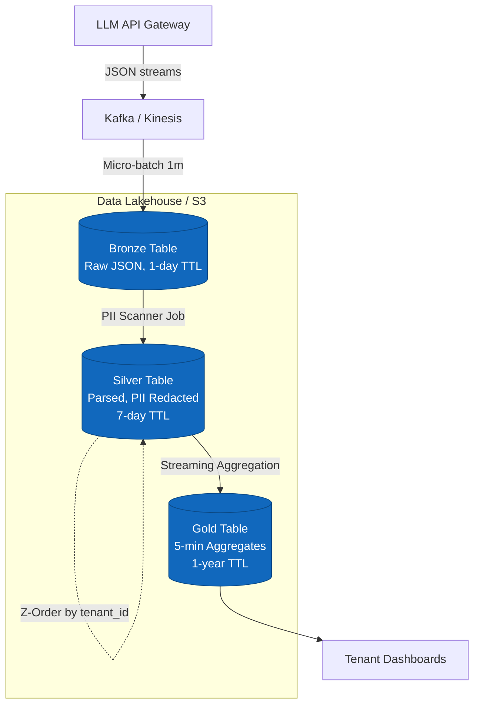

# Architecture Design Review: LLM Observability Lakehouse

## 1. Problem Statement
Our foundation-model API team handles **1 billion requests per day**, generating **5 TB/day of raw logs** (~5 KB per request). We must provide per-tenant cost and latency dashboards refreshed every 5 minutes. Full prompt/response payloads must be retained for 7 days for incident review, after which only aggregated metrics are kept for 1 year. Furthermore, PII must be redacted before human access, and the entire storage/compute footprint must not exceed **$5,000/month**. The challenge lies in balancing high-throughput ingestion, low-latency dashboard queries on a massive dataset, strict lifecycle management, and rigid FinOps constraints.

---

## 2. Architecture Diagram

**Data Flow Summary:**
1. **Ingestion**: API Gateway asynchronously publishes events to Kafka.
2. **Bronze**: Spark Structured Streaming consumes Kafka and writes raw JSON to Bronze S3 every 1 minute.
3. **Silver**: A streaming job parses JSON, applies PII redaction, and writes to Silver. An hourly maintenance job runs `OPTIMIZE ZORDER BY (tenant_id, timestamp)` to speed up ad-hoc incident queries.
4. **Gold**: A job aggregates metrics (p50/p95 latency, cost_usd) by `tenant_id` and 5-min windows, writing to Gold.

---

## 3. Key Decisions & Rejected Alternatives

### Decision 1: Streaming vs. Micro-batch Ingestion
* **I chose:** 1-minute micro-batches from Kafka to Bronze/Silver.
* **I rejected:** Continuous sub-second streaming.
* *Tradeoff:* True streaming creates an extreme small-file problem on S3 (millions of tiny Parquet files), driving up S3 PUT request costs and destroying read performance. Since our SLA for dashboards is 5 minutes, a 1-minute micro-batch safely meets the SLA while batching writes into larger, cost-efficient files.

### Decision 2: PII Redaction Strategy
* **I chose:** Asynchronous PII redaction between Bronze and Silver. Bronze is heavily locked down (no human access) and purged daily. Silver is the "clean" source of truth for humans.
* **I rejected:** Synchronous PII redaction at the API gateway layer.
* *Tradeoff:* Running regex/NER models on 5 KB prompts at the API layer adds unacceptable latency to the LLM serving path. Shifting redaction to the lakehouse isolates analytical workloads from production serving.

### Decision 3: Partitioning vs. Z-Ordering for Tenant Filtering (The Hot Path)
* **I chose:** Partition by `date(timestamp)` and `Z-ORDER BY (tenant_id, timestamp)` in the Silver table.
* **I rejected:** Partitioning by `tenant_id`.
* *Tradeoff:* With potentially thousands of tenants, partitioning by `tenant_id` causes metadata bloat and small files (Hive partition explosion). Date partitioning keeps the folder structure flat, while Z-Ordering on `tenant_id` provides excellent data-skipping (pruning) for the incident review hot path.

### Decision 4: Lifecycle and FinOps Tiering
* **I chose:** Native Delta Lake `VACUUM` with aggressive retention (`delta.deletedFileRetentionDuration = '7 days'`) on S3 Standard.
* **I rejected:** S3 Lifecycle rules moving data to Glacier/Intelligent Tiering.
* *Tradeoff:* Glacier has a minimum storage duration of 90 days. Since our compliance explicitly states we drop raw payloads after 7 days, moving to Glacier would incur early-deletion penalties. S3 Standard is cheaper for short-lived (7-day) data.

### Decision 5: Table Format
* **I chose:** Delta Lake.
* **I rejected:** Apache Iceberg.
* *Tradeoff:* While both are excellent, Delta Lake currently has tighter integration with Spark Structured Streaming's `MERGE` and `OPTIMIZE` operations. Specifically, the ability to concurrently run `OPTIMIZE ZORDER` while streaming inserts append to the table is highly stable in Delta 1.x.

---

## 4. Failure Modes (3 AM Scenarios)

1. **Failure: Small-file explosion degrades Gold dashboard performance.**
   * **Detection:** The 5-minute dashboard query latency spikes > 10 seconds.
   * **Rollback/Fix:** The background `OPTIMIZE` job failed. We pause the streaming job, manually run `dt.optimize().execute()`, and restart the stream. Gold aggregates are small enough that a full table rewrite takes < 1 minute.
2. **Failure: Bad schema deployment upstream breaks ingestion.**
   * **Detection:** Spark Streaming throws `AnalysisException` and data freshness drops.
   * **Rollback/Fix:** Delta's `schema_mode="merge"` handles safe evolutions. For destructive upstream changes (e.g., changing `latency_ms` from INT to STRING), we rely on Bronze's raw JSON storage. We fix the parsing logic in the Silver job, use Time Travel `RESTORE` to roll Silver back to the last good version, and replay the Bronze JSON from the failure point.
3. **Failure: PII Scanner drops data or crashes.**
   * **Detection:** Silver table row count diverges from Bronze row count by > 1%.
   * **Rollback/Fix:** Stop the Silver ingestion job. Fix the PII model. Delete the corrupted partitions in Silver, and replay the stream from the Kafka offsets corresponding to the incident start time.

---

## 5. Cost Back-of-envelope Math

**Storage Cost (S3 Standard @ $0.023 / GB):**
* Raw Ingestion: 5 TB/day.
* Compression: Parquet/Delta compresses JSON text by ~4x.
* Compressed size: 1.25 TB/day.
* Silver Table Retention: 7 days $\times$ 1.25 TB = **8.75 TB total storage**.
* Gold Table Retention: 1 year of 5-min aggregates. (10,000 tenants $\times$ 288 periods $\times$ 365 days = ~1 Billion rows $\approx$ 50 GB).
* **Storage Spend:** ~9 TB $\times$ $23/TB = **$207 / month**.

**Compute Cost (Spark / Databricks / EMR):**
* Streaming Ingestion (Bronze & Silver): 1 $\times$ 16-vCPU instance running 24/7 = ~$700/mo.
* Aggregation & Maintenance (OPTIMIZE): 1 $\times$ 8-vCPU instance = ~$350/mo.
* **Compute Spend:** **$1,050 / month**.

**S3 API Requests (PUT/GET):**
* 1-minute batches = 1,440 files/day. Negligible PUT costs.
* **API Spend:** **<$50 / month**.

**Total Monthly Spend:** $\sim$ **$1,307 / month**, leaving massive headroom under the **$5,000/month** budget.

---

## 6. What we will build first (1-Week MVP Slice)

We will not build the PII redaction model or the 7-day retention sweep in week one. 
**The MVP scope:**
1. Setup Kafka $\rightarrow$ Spark Structured Streaming $\rightarrow$ Bronze Delta table.
2. Build the streaming aggregation job directly from Bronze $\rightarrow$ Gold to calculate `p50_latency` and `total_cost` per tenant.
3. Hook up a basic BI dashboard to the Gold table.

*Goal:* Prove that we can ingest 1 billion events/day without crashing and meet the 5-minute dashboard SLA. Once the data pipe is stable, we insert the Silver layer and PII tokenization logic in week two.
